# Design Document

## Overview

The `arr-cli-mvp` design delivers five thin, read-only Python CLIs (`jellyfin`, `radarr`, `sonarr`, `maintainerr`, `seerr`) backed by a single shared facade module (`arr_facade`) that owns configuration loading, HTTP transport, authentication header injection, error mapping, and output formatting. Together the entry points expose **29 commands** — every operation a `GET` against its target service. The CLIs are designed for two operators: Lily (chat companion) consuming JSON on stdout from a shell pipeline, and Renald (operator) using `--human`/`-h` for ad-hoc terminal inspection.

The design follows the requirements' "five thin CLIs + one facade" split strictly: each executable contains only `argparse` glue and service-specific request builders; everything cross-cutting (config, transport, auth, output, errors) lives in `arr_facade` so a sixth service or a tier-2 mutation is a localized change. The MVP is **stateless per invocation** — no daemon, no mandatory cache, no shared mutable state — so it is safe to run from cron, CI, or interactive shells without cleanup.

Two design decisions are open at this stage and are documented inline as pre-locking verifications: the absence of a documented Maintainerr `/api/rules` endpoint (omitted from MVP per requirements, listed as future work) and the divergence between the requirements' Seerr `/api/v1/user/me` path and the Overseerr-spec canonical `/auth/me` (the design supports both with automatic 404 fallback).

## Project Alignment

### Technical Standards

The implementation conforms to the following Python ecosystem conventions:

- **Packaging:** Standard `pyproject.toml` (PEP 621) with one package (`arr_cli`) exposing five console-script entry points. No setup.py, no legacy `setup.cfg` build requirements.
- **Python version:** Targets Python 3.11+ to use `tomllib` (PEP 680, stdlib) for TOML parsing and modern `argparse` improvements (`argparse.BooleanOptionalAction`). This matches the requirements' "Python 3.11+" assumption.
- **TOML:** Parsed with `tomllib.load` (stdlib). Read-only by design (PEP 680); no third-party TOML dependency.
- **YAML:** Parsed with `PyYAML >= 6.0` using `safe_load` only. `yaml.load` is forbidden; the loader rejects YAML anchors that resolve to non-dict roots.
- **HTTP:** Uses `requests >= 2.28` for the facade transport layer (chosen over `urllib.request` for explicit `timeout=(connect, read)` semantics and ergonomic header injection). The design documents the choice so it is applied consistently across all five services.
- **CLI parsing:** Standard `argparse` (stdlib). No third-party CLI framework.
- **Testing:** `unittest` (stdlib) + `unittest.mock` for unit tests, `responses` for HTTP fixture testing, `pytest` as the runner only. No network calls in unit tests.
- **Logging:** `logging` (stdlib) with two handlers — a `StreamHandler` to stderr for diagnostics, and a separate formatter for the `--debug` trace path.
- **Typing:** Type hints throughout public interfaces (PEP 604 union syntax, available in 3.10+); `from __future__ import annotations` at the top of every module.

### Project Structure

```
/projects/media-cli/
├── pyproject.toml                    # PEP 621 metadata, console scripts, deps
├── README.md                         # install, config, command tables, auth matrix
├── CHANGELOG.md                      # MVP scope + out-of-scope list
├── .gitignore                        # arr.conf.example left in; arr.conf excluded
├── arr.conf.example                  # placeholder-only schema, committed
├── scripts/
│   ├── smoke.sh                      # one command per service x --human and --json
│   └── secret-scan                   # greps for committed API-key shapes
├── arr_cli/
│   ├── __init__.py
│   ├── facade/
│   │   ├── __init__.py
│   │   ├── config.py                 # ServiceConfig + AuthConfig + env resolution
│   │   ├── transport.py              # get() with per-call timeout and header injection
│   │   ├── errors.py                 # ArrError hierarchy + exit code map
│   │   ├── output.py                 # human() tabular formatter + JSON pass-through
│   │   ├── cli_common.py             # argparse base + --debug/--quiet/--human/--config/...
│   │   └── retry.py                  # exponential backoff for --retry N
│   ├── jellyfin.py                   # entry point: 8 commands
│   ├── radarr.py                     # entry point: 6 commands
│   ├── sonarr.py                     # entry point: 6 commands
│   ├── maintainerr.py                # entry point: 3 commands
│   └── seerr.py                      # entry point: 6 commands
└── tests/
    ├── unit/
    │   ├── test_config.py
    │   ├── test_transport.py
    │   ├── test_errors.py
    │   ├── test_output.py
    │   ├── test_jellyfin.py
    │   ├── test_radarr.py
    │   ├── test_sonarr.py
    │   ├── test_maintainerr.py
    │   └── test_seerr.py
    └── integration/                  # opt-in via --run-integration flag
        └── test_live_endpoints.py
```

Console-script entry points declared in `pyproject.toml` map each executable name to its module:

| Executable    | Module                     | Commands |
| ------------- | -------------------------- | -------- |
| `jellyfin`    | `arr_cli.jellyfin:main`    | 8        |
| `radarr`      | `arr_cli.radarr:main`      | 6        |
| `sonarr`      | `arr_cli.sonarr:main`      | 6        |
| `maintainerr` | `arr_cli.maintainerr:main` | 3        |
| `seerr`       | `arr_cli.seerr:main`       | 6        |

## Code Reuse Analysis

### Existing Components to Leverage

- **Python 3.11 stdlib (`tomllib`, `argparse`, `urllib.parse`, `logging`, `json`, `pathlib`, `dataclasses`):** Built-in TOML parsing eliminates the `tomllib` third-party pin; `argparse.BooleanOptionalAction` handles `--debug`/`--quiet` flags uniformly across all five CLIs without a custom parser. `urllib.parse.quote` percent-encodes every user-supplied value before it is interpolated into a URL.
- **`requests >= 2.28`:** Single dependency for HTTP, with explicit per-call `timeout=(connect, read)` and `Session()` reuse within an invocation for keep-alive on multi-request flows (e.g. future pagination).
- **`PyYAML >= 6.0` (`safe_load`):** Used only in the config loader; never instantiated elsewhere.
- **`responses` (test-only):** Intercepts `requests` calls so unit tests assert exact URL/header/body without touching the network.
- **`unittest.mock` (test-only):** Mocks the parsed config and HTTP responses for service-module tests so per-command routing can be verified in isolation.

### Integration Points

- **`arr.conf` at `~/.config/lily/arr.conf`:** The single source of truth for URLs, API keys, user ids. The loader accepts YAML or TOML by file extension and by leading-byte sniff, supports env-var overrides (`LILY_JELLYFIN_URL`, etc.), and refuses to parse a file with non-`0600` POSIX permissions.
- **Live service HTTP endpoints:** Each CLI's `arr_cli/<service>.py` module constructs endpoint URLs via `facade.transport.get(service, path, params=None)` so the auth header and timeout defaults are applied uniformly.
- **Live operator's instance:** Pre-locking verifications must be re-run against the operator's actual instance at integration time (see the Pre-locking Verifications section below).

> **Greenfield statement:** `/projects/media-cli` contains only `.git/` and an empty `.specs/arr-cli-mvp/` scaffold. No existing code, manifests, or prior index artefacts exist. There is nothing in-tree to reuse, extend, or integrate with beyond what is enumerated above. The README will state this explicitly per REQ-12 AC3.

## Architecture

### High-level data flow

```mermaid
graph TD
    User([Operator / Lily]) --> CLI[jellyfin / radarr / sonarr / maintainerr / seerr]
    CLI --> Facade[arr_facade]

    subgraph Facade
        Cfg[config.py<br/>ServiceConfig + AuthConfig]
        Tp[transport.py<br/>get&#40;service, path, params&#41;]
        Err[errors.py<br/>ArrError hierarchy]
        Out[output.py<br/>human&#40;payload, columns&#41;]
        Common[cli_common.py<br/>argparse base]
    end

    Cfg --> Tp
    Common --> Cfg
    Tp --> Err
    Tp -->|requests| HTTP[(Target Service HTTP API)]
    HTTP -->|JSON| Tp
    Tp --> Out
    Out --> Stdout([stdout])
    Err --> Stderr([stderr])

    subgraph Services
        JF[Jellyfin]
        RD[Radarr]
        SN[Sonarr]
        MN[Maintainerr]
        SR[Seerr]
    end

    HTTP --> JF
    HTTP --> RD
    HTTP --> SN
    HTTP --> MN
    HTTP --> SR
```



### Request lifecycle (sequence)

```mermaid
sequenceDiagram
    actor Op as Operator / Lily
    participant CLI as CLI entry point (e.g. jellyfin)
    participant Common as cli_common.py
    participant Cfg as config.py
    participant Tp as transport.py
    participant Svc as Target Service
    participant Err as errors.py
    participant Out as output.py

    Op->>CLI: jellyfin now [--human] [--config path]
    CLI->>Common: parse_args(argv)
    Common->>Common: bind --config, --debug, --quiet, --human,<br/>--connect-timeout, --read-timeout, --retry
    CLI->>Cfg: load_config(path, env_overrides=True)
    Cfg->>Cfg: sniff YAML vs TOML; raise ConfigError(1) on bad input
    Cfg-->>CLI: ServiceConfig(services={"jellyfin": ...})
    CLI->>Tp: get("jellyfin", "/Sessions", params=None)
    Tp->>Tp: inject auth header (X-Emby-Token)
    Tp->>Svc: requests.get(url, timeout=(5, 30))
    alt 2xx
        Svc-->>Tp: 200 OK + JSON body
        Tp-->>CLI: payload
        CLI->>Out: human(payload, columns) or pass-through JSON
        Out-->>Op: stdout
    else 401/403
        Svc-->>Tp: 401 / 403
        Tp->>Err: raise AuthError(service, op)
        Err-->>Op: stderr + exit 2
    else 4xx/5xx (non-auth)
        Svc-->>Tp: 4xx / 5xx
        Tp->>Err: raise HttpError(service, op, status, body_excerpt)
        Err-->>Op: stderr + exit 4
    else network failure
        Svc-->>Tp: ConnectionError / Timeout / DNS
        Tp->>Err: raise NetworkError(service, op, url, exc)
        Err-->>Op: stderr + exit 3
    else JSON parse failure
        Tp->>Err: raise ParseError(service, op, offset)
        Err-->>Op: stderr + exit 5
    end
```

### Config resolution precedence

```mermaid
flowchart TD
    Start([CLI invocation]) --> FlagCheck{--config<br/>path given?}
    FlagCheck -- yes --> UseFlag[Use --config path]
    FlagCheck -- no --> Default[Use ~/.config/lily/arr.conf]
    UseFlag --> Exists{File exists?}
    Default --> Exists
    Exists -- no --> Missing[stderr: missing config;<br/>exit 1]
    Exists -- yes --> PermCheck{Posix mode<br/>&le; 0600?}
    PermCheck -- no --> PermFail[stderr: insecure permissions;<br/>exit 1]
    PermCheck -- yes --> Sniff[Sniff leading byte:<br/>'{' → JSON/TOML, 'j' → JSON,<br/>'%' or alpha → YAML]
    Sniff --> ExtOverride{File extension<br/>.toml?}
    ExtOverride -- yes --> TOML[tomllib.load]
    ExtOverride -- no --> ExtOverride2{File extension<br/>.yaml/.yml?}
    ExtOverride2 -- yes --> YAML[yaml.safe_load]
    ExtOverride2 -- no --> ParseFail[stderr: unknown format;<br/>exit 1]
    TOML --> Validate
    YAML --> Validate{Schema valid?<br/>services.jellyfin / radarr /<br/>sonarr / maintainerr / seerr}
    Validate -- no --> ValFail[stderr: missing/invalid section;<br/>exit 1]
    Validate -- yes --> EnvLayer[Apply LILY_* env overrides]
    EnvLayer --> CacheCheck{Persistent cache<br/>configured?}
    CacheCheck -- no --> Ready([ServiceConfig ready])
    CacheCheck -- yes --> TmpDir[Use TMPDIR scratch only;<br/>no persistent cache in MVP]
    TmpDir --> Ready
```

## Components and Interfaces

### `arr_facade.config`

- **Purpose:** Load, validate, and resolve the canonical configuration file. Owns YAML/TOML parsing, env-var override layering, POSIX permission checks, and the `ServiceConfig` / `AuthConfig` dataclasses.
- **Interfaces:**

  ```python
  def load_config(
      path: Path | None = None,
      env_overrides: bool = True,
  ) -> ServiceConfig: ...

  @dataclass(frozen=True)
  class ServiceConfig:
      jellyfin:   AuthConfig | None
      radarr:     AuthConfig | None
      sonarr:     AuthConfig | None
      maintainerr: AuthConfig | None
      seerr:      AuthConfig | None
      connect_timeout: float  # seconds, default 5.0
      read_timeout: float     # seconds, default 30.0
      retry: int              # default 0

  @dataclass(frozen=True)
  class AuthConfig:
      url: str
      api_key: str | None
      user_id: str | None
      extra: dict[str, str]   # maintainerr auth headers; extensible
      auth_enabled: bool      # maintainerr only; default False
  ```

- **Dependencies:** `tomllib`, `PyYAML`, `pathlib`, `os.stat`.
- **Reuses:** `urllib.parse` for URL validation, stdlib `dataclasses` for the immutable config record.

### `arr_facade.transport`

- **Purpose:** Single HTTP entry point for all five CLIs. Attaches the correct auth header per service, applies per-call timeouts, centralizes retry policy, and translates raw `requests` exceptions into the `ArrError` hierarchy.
- **Interfaces:**

  ```python
  def get(
      service: Literal["jellyfin", "radarr", "sonarr", "maintainerr", "seerr"],
      path: str,
      params: dict[str, str] | None = None,
      *,
      cfg: ServiceConfig,
      connect_timeout: float | None = None,
      read_timeout: float | None = None,
  ) -> Any: ...   # returns parsed JSON; raises ArrError subclasses on failure

  def _inject_auth(headers: dict[str, str], service: str, auth: AuthConfig) -> None: ...
  ```

- **Dependencies:** `requests`, `arr_facade.config`, `arr_facade.errors`, `urllib.parse.quote`.
- **Reuses:** `requests.Session()` for keep-alive within a single invocation (no shared state across invocations).

### `arr_facade.errors`

- **Purpose:** Define the `ArrError` hierarchy and the canonical exit-code map. Every error carries `service`, `op`, and a structured message suitable for stderr.
- **Interfaces:**

  ```python
  class ArrError(Exception):
      service: str
      op: str
      exit_code: int  # always 1..5; see Error Handling section

  class ConfigError(ArrError):  ...   # exit_code = 1
  class AuthError(ArrError):    ...   # exit_code = 2
  class NetworkError(ArrError): ...   # exit_code = 3
  class HttpError(ArrError):    ...   # exit_code = 4
  class ParseError(ArrError):   ...   # exit_code = 5
  ```

- **Dependencies:** stdlib only.
- **Reuses:** `logging` for the `--debug` trace path (not for the default stderr surface).

### `arr_facade.output`

- **Purpose:** Render JSON payloads as tabular `--human` text, or pass JSON through verbatim. Enforce column caps and the `COLUMNS` environment variable.
- **Interfaces:**

  ```python
  def emit(payload: Any, *, human: bool, columns: list[str] | None = None) -> None: ...

  def human(payload: Any, columns: list[str], *, limit: int = 20, max_width: int = 120) -> str: ...
  ```

- **Dependencies:** stdlib `json`, `shutil.get_terminal_size`.
- **Reuses:** None beyond stdlib.

### `arr_facade.cli_common`

- **Purpose:** Shared `argparse` base. Defines the universal flag set (`--config`, `--debug`, `--quiet`, `--human`/`-h`, `--connect-timeout`, `--read-timeout`, `--retry`) and the per-service subcommand registration helpers.
- **Interfaces:**

  ```python
  def build_parser(
      prog: str,
      description: str,
      epilog: str | None = None,
  ) -> argparse.ArgumentParser: ...

  def main_wrapper(
      service: str,
      handler: Callable[[argparse.Namespace, ServiceConfig], int],
  ) -> Callable[[list[str] | None], int]: ...
  ```

- **Dependencies:** `argparse`, `arr_facade.config`, `arr_facade.transport`, `arr_facade.errors`, `arr_facade.output`.
- **Reuses:** Wraps `argparse.BooleanOptionalAction` (Python 3.9+ stdlib).

### `arr_facade.retry`

- **Purpose:** Optional exponential-backoff retry layer for `--retry N`. Respects `--deadline` and the per-call `read_timeout`.
- **Interfaces:**
  ```python
  def with_retry(
      fn: Callable[[], Any],
      *,
      attempts: int,
      deadline: float | None,
  ) -> Any: ...
  ```
- **Dependencies:** stdlib `time`, `random` (for jitter).
- **Reuses:** Operates on a closure passed by `transport.get`.

### `arr_jellyfin` (`arr_cli/jellyfin.py`)

- **Purpose:** Eight commands against Jellyfin: `now`, `resume`, `recent`, `nextup`, `latest`, `search <query>`, `item <id>`, `favorites`.
- **Interfaces:**
  ```python
  def cmd_now(args, cfg) -> int: ...
  def cmd_resume(args, cfg) -> int: ...
  def cmd_recent(args, cfg) -> int: ...
  def cmd_nextup(args, cfg) -> int: ...
  def cmd_latest(args, cfg) -> int: ...
  def cmd_search(args, cfg) -> int: ...
  def cmd_item(args, cfg) -> int: ...
  def cmd_favorites(args, cfg) -> int: ...
  def main(argv: list[str] | None = None) -> int: ...
  ```
- **Dependencies:** `arr_facade.*`.
- **Reuses:** Builds each request via `transport.get("jellyfin", path, params)`; never constructs URLs by string concatenation.

### `arr_radarr` (`arr_cli/radarr.py`)

- **Purpose:** Six commands against Radarr: `calendar [start [end]]`, `wanted`, `queue`, `recent`, `lookup <term>`, `movie <id>`.
- **Interfaces:** Same pattern as `arr_jellyfin` (`cmd_*` + `main`).
- **Dependencies:** `arr_facade.*`.
- **Reuses:** Date validation in `cmd_calendar` returns `ConfigError(exit_code=1)` with a stderr usage hint on malformed input (REQ-7 AC2).

### `arr_sonarr` (`arr_cli/sonarr.py`)

- **Purpose:** Six commands against Sonarr: `calendar [start [end]]`, `wanted`, `queue`, `recent` (`/api/v3/history`, not `/history/movie`), `lookup <term>`, `series <id>`.
- **Interfaces:** Same pattern as `arr_jellyfin`.
- **Dependencies:** `arr_facade.*`.
- **Reuses:** Date validation mirrors `arr_radarr`.

### `arr_maintainerr` (`arr_cli/maintainerr.py`)

- **Purpose:** Three commands against Maintainerr: `pending` (`/api/collections/overlay-data`), `storage` (`/api/storage-metrics`), `health` (`/api/health/ready`). Emits the documented one-line stderr warning when `auth.enabled = false`.
- **Interfaces:** Same pattern as `arr_jellyfin`.
- **Dependencies:** `arr_facade.*`.
- **Reuses:** Calls `cli_common.warn_once("maintainerr: auth disabled; ensure this CLI is reachable only on a trusted/private network")` exactly once per invocation when `--quiet` is not set (REQ-9 AC1).
- **Pre-locking note:** `/api/rules` is **NOT in MVP scope**; a `maintainerr rules` command is not implemented. The design reserves the slot for tier-2 work and explicitly does not silently assume the endpoint exists (REQ-9 AC5).

### `arr_seerr` (`arr_cli/seerr.py`)

- **Purpose:** Six commands against Seerr/Overseerr: `requests` (`/api/v1/request`), `request-count` (`/api/v1/request/count`), `search <query>` (`/api/v1/search/multi`), `available <query>` (`/api/v1/media/available`), `media <tmdbId>` (`/api/v1/media/{tmdbId}`), `user` (auth self-check).
- **Interfaces:** Same pattern as `arr_jellyfin`.
- **Dependencies:** `arr_facade.*`.
- **Reuses:** Uses `X-Api-Key` header per REQ-2 AC3.
- **Pre-locking note (HIGH PRIORITY):** The requirements specify `GET /api/v1/user/me` (REQ-10 AC6). The verified Overseerr API spec documents `GET /auth/me` (no `/api/v1` prefix, not under `/user/`). At design time we have **not yet** resolved the canonical path on the operator's live instance. The `cmd_user` implementation MUST try `/api/v1/user/me` first; if the service returns 404 it MUST transparently fall back to `/auth/me` and return the second response. Both attempts are logged at debug level. This resolves the spec divergence without forcing a re-write of REQ-10.
- **Future-work note:** `seerr create-request` (`POST /api/v1/request`) is **NOT in MVP** and does not appear in `--help`. If added in tier-2 it MUST be guarded by `--confirm` per REQ-10 AC7.

## Data Models

### `ServiceConfig`

```
@dataclass(frozen=True)
class ServiceConfig:
    jellyfin:    AuthConfig | None   # None if section absent
    radarr:      AuthConfig | None
    sonarr:      AuthConfig | None
    maintainerr: AuthConfig | None
    seerr:       AuthConfig | None
    connect_timeout: float = 5.0     # seconds
    read_timeout:    float = 30.0    # seconds
    retry:           int   = 0       # attempts on network failure
    deadline:        float | None = None
```

Resolution order (per REQ-1 AC7):

1. `--config <path>` flag, if given.
2. Otherwise `~/.config/lily/arr.conf`.
3. Parse by file extension or leading-byte sniff (`.toml` → `tomllib`, `.yaml`/`.yml` → `yaml.safe_load`).
4. Apply env overrides (`LILY_JELLYFIN_URL`, `LILY_JELLYFIN_API_KEY`, `LILY_JELLYFIN_USER_ID`, ..., `LILY_CONNECT_TIMEOUT`, `LILY_READ_TIMEOUT`, `LILY_RETRY`).

### `AuthConfig`

```
@dataclass(frozen=True)
class AuthConfig:
    url:          str                 # https://... or http://...
    api_key:      str | None = None
    user_id:      str | None = None   # jellyfin only (REQ-6 AC2-5,8)
    auth_enabled: bool      = False   # maintainerr only (REQ-9 AC1)
    extra:        dict[str, str] = field(default_factory=dict)
```

URLs are validated at parse time: must parse via `urllib.parse.urlparse` and have scheme in `{"http", "https"}` and a non-empty hostname. Non-conforming URLs fail closed with `ConfigError(exit_code=1)` per the security NFR.

### `ArrError` hierarchy

```
ArrError (base; carries service, op, exit_code)
├── ConfigError   exit_code = 1
├── AuthError     exit_code = 2
├── NetworkError  exit_code = 3
├── HttpError     exit_code = 4
└── ParseError    exit_code = 5
```

### Command result envelopes

By design, every command returns `int` (the exit code) and writes its payload to **stdout** via `arr_facade.output.emit`. There is no wrapper envelope on the wire — REQ-3 AC1 requires the top-level JSON to be the verbatim service payload, not a wrapped object. Diagnostics flow through stderr separately.

## Error Handling

### Exit code map (REQ-4 AC1, AC2, AC5; REQ-4 AC6)

| Code | Class          | Trigger                                                         | Example stderr                                                             |
| ---- | -------------- | --------------------------------------------------------------- | -------------------------------------------------------------------------- |
| 1    | `ConfigError`  | Missing config, bad perms, unknown format, malformed date input | `radarr: calendar — invalid date 'next-tuesday'; expected ISO-8601`        |
| 2    | `AuthError`    | HTTP 401/403 from service, or missing required credential       | `jellyfin: op=now — 401 Unauthorized; check jellyfin.api_key in arr.conf`  |
| 3    | `NetworkError` | DNS, connection refused, TLS, timeout                           | `radarr: op=calendar url=https://radarr.example/api/v3/calendar — Timeout` |
| 4    | `HttpError`    | HTTP 4xx (non-auth) or 5xx                                      | `sonarr: op=series id=42 status=404 message=Series not found`              |
| 5    | `ParseError`   | JSON decode failure                                             | `seerr: op=user — invalid JSON at byte offset 17`                          |

### Error scenario handling

1. **Service unreachable (REQ-4 AC1):** Caught by `transport.get` wrapping `requests.exceptions.ConnectionError`, `Timeout`, `SSLError`, `requests.exceptions.RequestException` generically. Translated to `NetworkError(exit_code=3)`. Stderr message names `service`, `op`, `url`, and the underlying `exc.__class__.__name__`. Per-service independence: each command is its own process; a failed invocation does not affect any later one.

2. **HTTP 4xx/5xx (REQ-4 AC2, REQ-4 AC3):** All non-2xx responses are caught in `transport.get`. 401/403 raise `AuthError(exit_code=2)`. Other 4xx/5xx raise `HttpError(exit_code=4)`. Stderr message includes `service=`, `op=`, `status=`, `message=`, and a body excerpt truncated to 500 characters (REQ-4 AC2). No Python traceback by default.

3. **Missing required service section (REQ-1 AC6):** `config.load_config` returns a `ServiceConfig` with the corresponding field as `None`. Each CLI's `main()` checks `cfg.<service>` before dispatching; on `None` it raises `ConfigError(exit_code=1)` with a stderr message naming the missing section (e.g. `jellyfin: section missing in arr.conf`).

4. **Missing credentials (REQ-2 AC6):** `transport.get` checks `auth.api_key` for any service that requires one. If absent and a command for that service runs, the CLI raises `AuthError(exit_code=2)` with stderr naming the missing key (e.g. `jellyfin: api_key missing — set jellyfin.api_key in arr.conf`).

5. **Unknown CLI arguments (REQ-11 AC4):** `argparse` rejects unknown args via the default parser; the CLI exits `1` with a usage hint on stderr. Stable across all five services.

6. **JSON parse failure (REQ-4 AC6):** Caught in `transport.get` after `response.json()`. Translated to `ParseError(exit_code=5)` with the first non-JSON byte offset in the stderr message.

7. **Maintainerr 401/403 unexpectedly (REQ-9 AC6):** Special-cased stderr guidance: `maintainerr: 401/403 received — set auth.enabled=true in arr.conf and restart`, then raise `AuthError(exit_code=2)` like any other service.

### `--debug` toggle (REQ-4 AC5)

- Default: stderr shows only the structured `service=... op=... status=... message=...` line.
- `--debug`: in addition, full Python traceback and a request/response pair (URL, headers with **secrets redacted to `\***` while preserving the header name and token length\*\*, status, body) are written to stderr. The redaction is unconditional per the security NFR.
- `--quiet`: suppresses the Maintainerr auth-disabled warning (REQ-9 AC1) and any informational stderr lines, but errors still surface.

### Per-service independence (REQ-4 AC4)

Each CLI invocation is a single process. There is no shared daemon, no cache, and no module-level mutable state (other than the read-only constants for exit codes and error messages). A failed invocation exits cleanly, releases its `requests.Session`, and does not affect any subsequent invocation.

## Pre-locking Verifications

These checks were already executed by the parent session and the findings are baked into this design. They MUST be re-run at integration time against the operator's actual instance before tagging the MVP release.

### Maintainerr `/api/rules` — OUT OF MVP scope

- **Status:** Verified against `docs.maintainerr.info`. No `/api/rules` endpoint is documented in the Maintainerr public API reference.
- **Design impact:** A `maintainerr rules` command is **NOT** implemented in MVP. REQ-9 AC5 explicitly states "the system SHALL NOT silently assume the endpoint exists". The design reserves the slot for tier-2 work and notes in the README that adding it requires confirming the live `/api/swagger` on the operator's instance.
- **Re-verification at integration time:** Run `curl -s http://<maintainerr-host>/api/swagger | jq '.paths | keys | map(select(test("rules")))'` against the operator's instance. If `/api/rules` is present, add the command in tier-2; if absent, document the absence in the integration PR.

### Seerr `/api/v1/user/me` — OPEN, design supports both paths

- **Status:** Verified against the Overseerr API spec (which Seerr inherits). The Overseerr canonical auth-self-check endpoint is `GET /auth/me` — **no `/api/v1` prefix**, not under `/user/`. The requirements specify `/api/v1/user/me` (REQ-10 AC6). The divergence is unresolved at design time because the operator's live instance has not been inspected.
- **Design impact:** `cmd_user` in `arr_cli/seerr.py` implements a two-step probe:
  1. Attempt `GET /api/v1/user/me` first.
  2. If the response is `404 Not Found`, immediately retry `GET /auth/me`.
  3. Return whichever succeeds; if both 404, raise `HttpError(exit_code=4)`.
  4. Both attempts are logged at `DEBUG` level (including status and URL) so the operator can see which path was used.
- **Why not lock to one path:** REQ-10 AC6 names `/api/v1/user/me`; the spec source names `/auth/me`. Locking prematurely risks either a wrong spec or a non-functional MVP. The probe resolves the discrepancy on the operator's instance at runtime.
- **Re-verification at integration time:** Run `curl -s -H "X-Api-Key: $KEY" http://<seerr-host>/api/v1/openapi.json | jq '.paths | keys'` against the operator's instance. Identify the canonical auth-self-check path, update the requirements if needed, and remove the probe (or codify it as a documented fallback) in the integration PR.

### Deferred verifications (documented in this design)

The following endpoints were not yet verified at design time and will be re-checked at integration time. Each is documented in the design to avoid silent assumption:

- **Seerr `/api/v1/request/count`** (REQ-10 AC2): Overseerr spec shows `/api/v1/request/count`. Low risk; re-verify against the operator's `/api/v1/openapi.json` at integration time.
- **Seerr `/api/v1/media/available`** (REQ-10 AC4): Overseerr spec shows `/api/v1/media/available`. Low risk; re-verify at integration time.
- **Seerr `/api/v1/media/{tmdbId}`** (REQ-10 AC5): Overseerr spec shows `/api/v1/media/{tmdbId}`. Low risk; re-verify at integration time.

## Testing Strategy

### Unit testing

- **`tests/unit/test_config.py`:** YAML/TOML parsing, env-var layering, missing-file behaviour, bad-permission rejection, unknown-format rejection, URL validation.
- **`tests/unit/test_transport.py`:** Uses the `responses` library to assert exact URL, headers (including auth injection per REQ-2 AC1-4), timeout tuple, and response handling for 200/401/403/404/500/timeout/JSON-parse-failure.
- **`tests/unit/test_errors.py`:** Asserts the exit-code map (1..5) and that each error class emits a structured `service=... op=... status=... message=...` line on stderr.
- **`tests/unit/test_output.py`:** Asserts JSON pass-through, `--human` table rendering, `COLUMNS` honouring, truncation with `…`, and that diagnostics never leak into stdout.
- **`tests/unit/test_jellyfin.py`, `test_radarr.py`, `test_sonarr.py`, `test_maintainerr.py`, `test_seerr.py`:** Per-command routing tests using `unittest.mock` for the parsed config and `responses` for HTTP. Each test asserts the exact path, query params, auth header, and exit code for the command's success and at least one error path.

### Coverage targets

- **Line coverage:** ≥ 90 % on `arr_facade/`. The facade owns the cross-cutting logic and is the highest-leverage target for regression.
- **Branch coverage:** ≥ 80 % overall.
- **Command coverage:** 100 % of the 29 commands have at least one success-path and one error-path test.

### CI hooks (deferred to tasks phase)

- **`scripts/smoke.sh`:** One command per service (`jellyfin now`, `radarr calendar`, `sonarr calendar`, `maintainerr health`, `seerr user`), exercised with both `--human` and default JSON, exits non-zero on any failure (per the usability NFR).
- **`scripts/secret-scan`:** Greps for common API-key token shapes and fails the build if any are found committed (per the security NFR).
- **CI workflow:** A `make ci` target running `pytest tests/unit`, `scripts/secret-scan`, and `scripts/smoke.sh --dry-run` (the dry-run mode asserts the per-service command grammar without making network calls). The full smoke run is gated behind a `RUN_LIVE=1` env var so CI never touches the operator's instance without explicit opt-in.

## Performance Budgets (REQ NFR-Performance)

The MVP carries explicit performance acceptance criteria; the design meets them as follows:

| Budget               | Target                        | How the design meets it                                                                                                                                                                                                                                                                                     |
| -------------------- | ----------------------------- | ----------------------------------------------------------------------------------------------------------------------------------------------------------------------------------------------------------------------------------------------------------------------------------------------------------- |
| Cold-start (process) | ≤ 2 s                         | Stdlib-only facade + lazy imports of `requests`/`yaml`/`tomllib` in each CLI entry point; no eager initialization, no module-level network I/O. A `time python -c 'import arr_cli.jellyfin'` measurement is added to `scripts/smoke.sh --dry-run` and gates CI.                                             |
| Peak resident memory | ≤ 80 MiB                      | Per-invocation `requests.Session()` (released on process exit); no in-memory payload cache; tabular `--human` mode streams rather than holding the full payload twice; `tracemalloc` snapshot in `tests/unit/test_perf_budgets.py` asserts `< 80 * 1024 * 1024` after a representative 10,000-item payload. |
| Per-command latency  | dominated by service response | Default `connect_timeout=5s` and `read_timeout=30s`; `--retry` defaults to 0 (no double-work); no global locks, no daemon IPC.                                                                                                                                                                              |
| Large-payload cap    | 10,000 items                  | `transport.get` accepts a `max_items` kwarg; default 10,000. Larger responses are truncated with a stderr warning naming the count and the cap (REQ NFR-Performance AC).                                                                                                                                    |

These budgets are enforced as unit tests so any regression fails CI before tag time.

## Documentation Deliverables (REQ-12)

The MVP ships two documentation files. Their required contents are enumerated here so the implementer does not produce either file as a stub.

### `README.md` — required sections (in order)

1. **Purpose**: one-paragraph statement of what the package is and who it is for (Lily the chat companion and Renald the operator).
2. **Canonical config path**: `~/.config/lily/arr.conf`, with a note that `--config <path>` overrides it per-invocation.
3. **Placeholder-only example**: an embedded code block showing `arr.conf.example` contents (verbatim copy of the placeholder schema in the Data Models section above). The README must explicitly state: _"Do not commit a real arr.conf. Real keys go in a local file only; `arr.conf.example` ships with placeholders."_
4. **Per-service command tables**: five tables (one per service), each with columns `Command`, `HTTP method`, `Path`, `Notes`. The 29 commands map 1:1 with the table in the Components and Interfaces section above.
5. **Auth matrix**: a table showing per-service `Header` and `Header value source` (a verbatim copy of the auth matrix in the Components and Interfaces section).
6. **Install / invoke instructions**: `pip install -e .[dev]` for development install, then one example invocation per service (e.g. `arr-jellyfin now --human`, `arr-radarr wanted`, `arr-sonarr calendar 2026-01-01 2026-01-31`, `arr-maintainerr health`, `arr-seerr user`).
7. **Exit codes**: a table with the 5 codes, their class, and an example trigger (copy from the Error Handling section).
8. **Out-of-scope (tier-2) list**: bullet list naming Maintainerr `veto`, Seerr `create-request`, mutations, webhooks, daemon/cache layer.
9. **Contributing**: one sentence — _"Nothing gets hardcoded. Any new service, command, or config key that hardcodes a URL, key, or user-id will be rejected at review."_

### `CHANGELOG.md` — required `## MVP` entry

```
## MVP

### Added
- Five read-only CLI scripts:
  - `arr-jellyfin` — 8 commands (now, resume, recent, nextup, latest, search, item, favorites)
  - `arr-radarr` — 6 commands (calendar, wanted, queue, recent, lookup, movie)
  - `arr-sonarr` — 6 commands (calendar, wanted, queue, recent, lookup, series)
  - `arr-maintainerr` — 3 commands (pending, storage, health)
  - `arr-seerr` — 6 commands (requests, request-count, search, available, media, user)
- Shared `arr_facade` package: config loader, HTTP transport, error hierarchy, output formatter, CLI common.
- Single canonical config at `~/.config/lily/arr.conf` (YAML or TOML), gitignored by default.
- JSON default output; `--human`/`-h` for tabular readable mode.
- Five exit codes (1 config, 2 auth, 3 network, 4 HTTP-status, 5 parse).
- `scripts/smoke.sh` and `scripts/secret-scan` for CI hygiene.

### Out of scope (deferred to tier-2)
- Maintainerr `veto` (`POST /api/collections/media/handle`)
- Seerr `create-request` (`POST /api/v1/request`)
- Any write/mutate endpoint on any service
- Webhook receivers
- Long-running daemon or persistent cache layer
- Maintainerr `/api/rules` (not in current Maintainerr OpenAPI; re-evaluate at next upstream API revision)
```

The MVP entry MUST be the only section in the CHANGELOG until tier-2 ships. Pre-1.0 versioning applies (`0.1.0` is the MVP tag).

## Naming Convention (clarification for the implementer)

Throughout this document, two package-name forms appear:

- **`arr_cli.*`** — the actual Python import path. `arr_cli` is the top-level package; `arr_cli.facade`, `arr_cli.jellyfin`, etc. live inside it. This is what `pyproject.toml` declares and what console-script entry points target.
- **`arr_facade`** — a shorthand for the **facade sub-package** (`arr_cli.facade`) used in section headings, Mermaid labels, and prose for readability. When the prose says "`arr_facade` does X" it means "`arr_cli.facade` does X". When code samples show `arr_facade.config.load_config(...)`, the implementer MUST map that to `from arr_cli.facade import config` and call `config.load_config(...)`.

This is a documentation convention, not a code path. The implementer resolves it once at module-init and never thinks about it again. Any reviewer confusion (e.g. a future diff that imports `arr_facade` directly without the `arr_cli.` prefix) is a bug to be rejected at PR review per REQ-12 AC3's "nothing gets hardcoded" rule applied to import paths.
