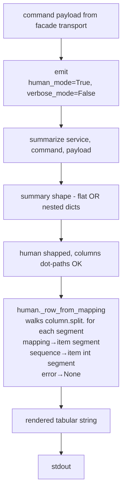
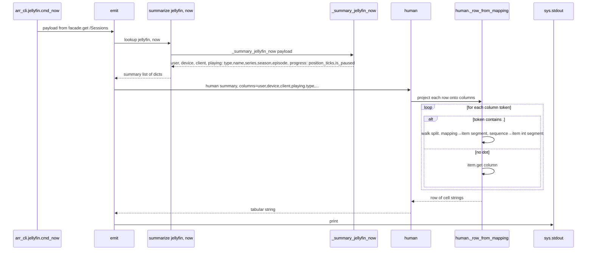
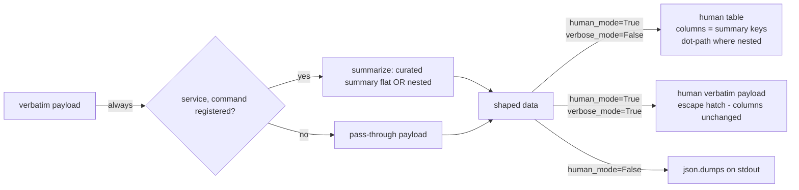

# Design Document

## Overview

`arr-cli` is a read-only Python CLI suite (5 executables, 29 commands total) wrapping a self-hosted media server stack. Three output shapes exist per command: a curated per-command summary (the no-flag default JSON for the 15 size-to-summary candidate commands), a verbatim service payload (`--verbose`), and a tabular readable view (`--human` / `-h`). The renderer priority chain lives in `arr_cli.facade.output.emit` at `arr_cli/facade/output.py`.

PR #6 on branch `fix/human-tracks-default-shape` already fixed the renderer-selection layer: `summarize(service, command, payload)` now runs before `human()` whenever `human_mode=True, verbose_mode=False`, so the data shape feeding the `--human` table matches the no-flag JSON. The remaining bug is that the per-service `columns = [...]` blocks in `arr_cli/{jellyfin,radarr,sonarr,maintainerr,seerr}.py` were written against the verbatim-payload shape and never updated to match the curated summary shape that `summarize()` produces — every cell in the table renders as `<null>`.

This feature (human-columns-match-summary) does three things:

1. **Re-key 14 per-service `columns = [...]` blocks** to match the summary shape emitted by `arr_cli.facade.output._SUMMARY_RENDERERS[(service, command)]`. One handler (`maintainerr -h pending`) is already aligned and is not rewritten.
2. **Add dot-path traversal to `human._row_from_mapping`** in `arr_cli/facade/output.py` so column tokens like `playing.type`, `movie.title`, `series.title`, `episode.title`, `requestedBy.displayName`, `mediaInfo.tmdbId`, `mediaInfo.status` resolve against the nested summary fields (the 6 of 15 size-to-summary commands whose summary renderers emit nested dicts).
3. **Add a regression net** in `tests/unit/test_output.py` that pins every column-block → summary-shape alignment so future drift trips `make ci`.

The fix is local to:
- `arr_cli/facade/output.py` (one targeted change to `_row_from_mapping` only)
- `arr_cli/{jellyfin,radarr,sonarr,seerr}.py` (columns-block rewrites — maintainerr.py untouched)
- `tests/unit/test_output.py` (regression net)

Out of scope (per the approved requirements):
- The `emit()` routing fix from PR #6 — unchanged
- The `_SUMMARY_RENDERERS` dispatch table — unchanged (same 15 entries)
- Any of the 17 `_summary_*` renderer bodies' output shape — unchanged
- New commands or new tabular columns
- SKILL.md updates (zero matches to drop in this round)

## Project Alignment

### Technical Standards

The design follows the project's authoritative `AGENTS.md` rules:

- **Facade-only renderer dispatch** (`AGENTS.md §1`, §4.3): the renderer priority chain is owned by `arr_cli.facade.output.emit`. The dot-path traversal is a small targeted change to `human._row_from_mapping` (also in the facade); the per-service CLI files delegate the renderer-selection layer to the facade and only need their `columns = [...]` literals re-keyed.
- **No new runtime dependencies** (`AGENTS.md §4.1`): the fix reuses `summarize()`, `_SUMMARY_RENDERERS`, the 17 `_summary_*` renderers, `human()`, and `emit()` — all already in the codebase. No edits to `pyproject.toml`.
- **Pure functions for summary shaping** (`AGENTS.md §4.3`): `summarize()` and the 17 `_summary_*` renderers are pure (no I/O, no logging, no `print`) — the dot-path change is also pure.
- **Python ≥ 3.11 syntax + two-space indent + type hints on public functions** (`AGENTS.md §4.1`): the patch matches the surrounding file.
- **Hermetic unit tests** (`AGENTS.md §4.2` rule 5): new tests live in `tests/unit/test_output.py` using `responses` / in-process mocks; no live HTTP.
- **`make ci` and `make lint` gates** (`AGENTS.md §3`): the patch must pass `make test && make secret-scan && make smoke-dry` and the `py_compile` sweep.
- **Stable exit-code contract** (`AGENTS.md §6`): no new error path; `stdout` stays pipe-clean tabular text on the `--human` branch; diagnostics stay on stderr.

### Project Structure

The change is surgical and stays inside the facade + per-service CLIs + their tests:

- `arr_cli/facade/output.py` — `human._row_from_mapping` at line ~280 (single targeted change for dot-path traversal). All other functions in this file (`emit`, `summarize`, the 17 `_summary_*` renderers, `_SUMMARY_RENDERERS`, `human` body, `resolve_width`, helpers) are unchanged.
- `arr_cli/jellyfin.py` — `cmd_now`, `cmd_resume`, `cmd_recent`, `cmd_latest`, `cmd_favorites` columns blocks (5 rewrites; `cmd_nextup`, `cmd_search`, `cmd_item` untouched per Req 17 AC3).
- `arr_cli/radarr.py` — `cmd_wanted`, `cmd_queue`, `cmd_recent` columns blocks (3 rewrites; `cmd_calendar`, `cmd_lookup`, `cmd_movie` untouched per Req 17 AC3).
- `arr_cli/sonarr.py` — `cmd_wanted`, `cmd_queue`, `cmd_recent` columns blocks (3 rewrites; `cmd_calendar`, `cmd_lookup`, `cmd_series` untouched per Req 17 AC3).
- `arr_cli/seerr.py` — `cmd_requests`, `cmd_search`, `cmd_available` columns blocks (3 rewrites; `cmd_request_count`, `cmd_media`, `cmd_user` untouched per Req 17 AC3).
- `arr_cli/maintainerr.py` — UNTOUCHED. `cmd_pending` columns block is already aligned with `_summary_maintainerr_pending` (per Req 15 AC1-AC2); `cmd_storage`, `cmd_health` are untouched per Req 17 AC3.
- `tests/unit/test_output.py` — three new classes appended (regression net; see Testing Strategy).

No file outside this list is modified. No new module-level comment noise (per `AGENTS.md §4.1` "No comments unless they explain non-obvious why").

## Code Reuse Analysis

The fix leans entirely on existing, well-trod facade primitives. No new helpers, no parallel dispatch tables, no per-command wiring beyond the columns-block rewrites.

### Existing Components to Leverage

- **`arr_cli.facade.output.human._row_from_mapping`** (`arr_cli/facade/output.py:280`): single helper that today does `[_stringify(item.get(column)) for column in columns]`. The dot-path extension teaches it to split a column token on `.` and walk the segments: mapping → subscript with string, sequence → subscript with `int(segment)`, on `KeyError`/`IndexError`/`TypeError` return `None`. The non-dotted path remains a strict subset (no behavior change for the 9 flat-summary commands).
- **`arr_cli.facade.output._SUMMARY_RENDERERS`** (`arr_cli/facade/output.py:859`): the 15-entry dispatch table whose per-key renderer output shapes drive the per-service `columns = [...]` block rewrites. Already correct after PR #6; only used as the source-of-truth for the new regression net.
- **`arr_cli.facade.output._summary_*` renderers** (17 functions in `arr_cli/facade/output.py`): the source-of-truth for the per-service column lists. The regression net imports them via `_SUMMARY_RENDERERS.values()` and runs each on a minimal realistic input to derive the summary-shape keys (top-level + dot-joined nested).
- **`arr_cli.facade.output.human`** (`arr_cli/facade/output.py:300`): the table renderer; the dot-path traversal is a targeted edit inside one of its private helpers, leaving the public signature unchanged.
- **Per-service `_emit` thin wrappers** in `arr_cli/{jellyfin,radarr,sonarr,maintainerr,seerr}.py`: each already threads `service` and `command` into `emit(...)`; the columns-block rewrite is purely the literal `columns = [...]` value passed into `_emit(...)`.
- **`DEFAULT_LIMIT` / `DEFAULT_MAX_WIDTH` constants**: untouched; the dot-path change does not affect `limit` / `max_width` forwarding.

### Integration Points

- **`tests/unit/test_output.py`**: the existing test file already imports `emit`, `summarize`, `_SUMMARY_RENDERERS`, `human`, and all 17 `_summary_*` renderers. New tests reuse the same import surface and exercise the new dot-path semantics with `io.StringIO` capture and `responses` mocks, no live HTTP. Three new classes appended (one for columns-block alignment, one for non-null per-cell render, one for dot-path traversal).
- **`scripts/smoke.sh`**: the CLI-grammar dry-run is unaffected because no flag grammar changes; only literal `columns = [...]` values in per-service CLI files.
- **`make ci`**: all three sub-targets (`make test`, `make secret-scan`, `make smoke-dry`) keep their existing semantics; the new tests are additive.

## Architecture

The renderer-selection layer (`emit()`) is unchanged from PR #6. The dot-path fix is local to `human._row_from_mapping`:



The data flow for a `--human` invocation on a nested-summary-shape command (`jellyfin -h now`):



The flat-summary-shape path (9 of 15 commands) is unchanged: `column.split(".")` yields a single segment, the walk is equivalent to `item.get(column)`, no behavior difference. The non-dotted branch is the strict subset, exactly per Req 16 AC2.



## Components and Interfaces

### Component 1 — `human._row_from_mapping` (modified)

- **Purpose:** Project a mapping onto a list of column tokens, returning a list of cell strings. The current implementation (`arr_cli/facade/output.py:280`) does `[_stringify(item.get(column)) for column in columns]`. The post-fix version walks dot-separated column tokens.
- **Interfaces:** private helper, signature unchanged: `_row_from_mapping(item: Mapping[str, Any], columns: Sequence[str]) -> list[str]`.
- **Dependencies:** `Mapping`, `Sequence` from `typing`; `_stringify` from same module.
- **Reuses:** `_stringify` for value rendering; falls back to `item.get(column)` for non-dotted tokens (strict subset of pre-change behavior).

#### Behavioral change (diff-shaped description)

- **TODAY:** `[_stringify(item.get(column)) for column in columns]` — flat `dict.get` only.
- **AFTER:** for each column token, split on `.`; for each segment, if current is a `Mapping` subscript `current[segment]`; if a `Sequence` subscript `current[int(segment)]`; on `KeyError`/`IndexError`/`TypeError` return `None`. Single-segment tokens (no dot) reduce to the pre-change `item.get(column)` behavior (Req 16 AC2).

The change is ~10 lines inside one private helper. No public signature changes, no new public functions, no new imports.

### Component 2 — Per-service `columns = [...]` blocks (modified, 14 of 16)

- **Purpose:** Tell `human()` which keys of the summary dict to project into table columns for the `--human` path.
- **Interfaces:** Each `cmd_*` function in `arr_cli/{jellyfin,radarr,sonarr,seerr}.py` has a local `columns: Sequence[str] | None = [...]` literal that gets passed into `_emit(...)`.
- **Dependencies:** None new.
- **Reuses:** Same as today.

#### Per-handler column-block rewrites (the 14 commands)

For each rewrite, the new literal exactly matches the summary shape:

| Command | New `columns = [...]` literal | Summary shape source |
|---|---|---|
| `jellyfin.cmd_now` | `["user", "device", "client", "playing.type", "playing.name", "playing.series", "playing.season", "playing.episode", "progress.position_ticks", "progress.is_paused"]` | `_summary_jellyfin_now` |
| `jellyfin.cmd_resume` | `["Name", "Type", "ProductionYear", "SeriesName", "UserData.PlaybackPositionTicks", "UserData.PlayCount"]` | `_summary_jellyfin_resume` (flat keys with dots) |
| `jellyfin.cmd_recent` | `["Name", "Type", "ProductionYear", "SeriesName", "UserData.LastPlayedDate"]` | `_summary_jellyfin_recent` |
| `jellyfin.cmd_latest` | `["Name", "Type", "ProductionYear", "SeriesName", "DateCreated"]` | `_summary_jellyfin_latest` |
| `jellyfin.cmd_favorites` | `["Name", "Type", "ProductionYear", "SeriesName"]` | `_summary_jellyfin_favorites` |
| `radarr.cmd_wanted` | `["title", "year", "tmdbId", "monitored"]` | `_summary_radarr_wanted` |
| `radarr.cmd_queue` | `["title", "status", "trackedDownloadStatus", "size", "sizeleft"]` | `_summary_radarr_queue` |
| `radarr.cmd_recent` | `["movie.title", "movie.year", "eventType", "date"]` | `_summary_radarr_recent` (nested) |
| `sonarr.cmd_wanted` | `["title", "seasonNumber", "episodeNumber", "airDate", "monitored"]` | `_summary_sonarr_wanted` |
| `sonarr.cmd_queue` | `["title", "status", "trackedDownloadStatus", "size", "sizeleft"]` | `_summary_sonarr_queue` |
| `sonarr.cmd_recent` | `["series.title", "episode.title", "eventType", "date"]` | `_summary_sonarr_recent` (nested) |
| `seerr.cmd_requests` | `["title", "type", "status", "createdAt", "requestedBy.displayName"]` | `_summary_seerr_requests` (nested) |
| `seerr.cmd_search` | `["title", "mediaType", "releaseDate", "mediaInfo.tmdbId"]` | `_summary_seerr_search` (nested) |
| `seerr.cmd_available` | `["title", "mediaType", "releaseDate", "mediaInfo.status"]` | `_summary_seerr_available` (nested) |

The 15th size-to-summary handler — `maintainerr.cmd_pending` — is **already aligned** (Req 15 AC1-AC2) and SHALL NOT be touched. The 14 verbatim-only commands listed in Req 17 AC3 SHALL NOT be touched.

### Component 3 — `_SUMMARY_RENDERERS` dispatch table (unchanged)

- **Purpose:** Single registration point for the 15 size-to-summary candidate commands. Same 15 entries after the fix; no additions, no removals.
- **Interfaces:** `dict[tuple[str, str], Callable[[Any], Any]]` already typed.
- **Dependencies:** None new.
- **Reuses:** All 17 `_summary_*` renderer functions (none modified).

### Component 4 — `human()` (unchanged in public signature)

- **Purpose:** Generic tabular renderer for arbitrary JSON-decoded values; the existing table renderer at `arr_cli/facade/output.py:300`. Only the private `_row_from_mapping` helper changes.
- **Interfaces:** public `human(value, *, columns, limit, max_width) -> str` — signature unchanged.
- **Dependencies:** Stdlib only.
- **Reuses:** Same as today; only `_row_from_mapping` is touched.

### Component 5 — `emit()` (unchanged)

- **Purpose:** Renderer-selection layer; the priority chain (`--human` > `--verbose` > default summary > verbatim) is documented in its docstring. PR #6 already corrected the `human_mode` branch to call `summarize()` first.
- **Interfaces:** public `emit(payload, *, human_mode, verbose_mode=False, service="", command="", columns=None, limit=DEFAULT_LIMIT, max_width=DEFAULT_MAX_WIDTH, stream=None)` — signature unchanged.
- **Dependencies:** Same as today.
- **Reuses:** Same as today; this feature does not touch `emit()` at all.

### Component 6 — New regression tests in `tests/unit/test_output.py` (3 classes appended)

- **Purpose:** Pin every column-block → summary-shape alignment plus dot-path traversal behavior (per Req 18 AC1-AC8).
- **Interfaces:** Pytest classes; `responses` already used elsewhere; `io.StringIO` capture for `stream=`.
- **Dependencies:** `pytest`, `responses`, `arr_cli.facade.output.{emit, summarize, human, _SUMMARY_RENDERERS, _summary_*}`, `arr_cli.{jellyfin, radarr, sonarr, maintainerr, seerr}` for the columns-literal extraction.
- **Reuses:** Existing `_capture_stdout` helper and `_SUMMARY_RENDERERS` import already in the test file; `ast.literal_eval` (stdlib) to extract `columns = [...]` literals from per-service `cmd_*` function bodies when direct import is awkward.

## Data Models

The feature does not introduce a new data model; it relinks existing ones to different downstream consumers. The three relevant shapes are already defined elsewhere.

### Model 1 — Verbatim service payload (unchanged, out of scope)

```
- kind: arbitrary JSON-decoded value from the upstream service
- source: arr_cli.facade.transport.get(...); same bytes the service returned
- examples:
    /Sessions -> list[dict] with NowPlayingItem.*, PlayState, ...
    /api/v3/queue -> list[dict] with full Radarr queue objects
- consumer (UNCHANGED): human() in the --verbose --human escape-hatch branch
```

### Model 2 — Curated summary shape (unchanged, out of scope)

```
- kind: JSON-serializable structure hand-shaped by _summary_<svc>_<cmd>
- 9 flat-shape commands: jellyfin recent/favorites/resume/latest, radarr wanted/queue, sonarr wanted/queue, maintainerr pending
- 6 nested-shape commands: jellyfin now, radarr recent, sonarr recent, seerr requests/search/available
- consumer after fix: human(summary, columns=[...], ...) -- column keys now match summary keys
- consumer today (UNCHANGED): json.dumps(summary) for the default branch
```

### Model 3 — Tabular string (output of `human()`, post-fix consumer)

```
- kind: str (multi-line table with header, separator, and data rows)
- consumers: stdout (via emit) and tests (via io.StringIO capture)
- columns are derived from the summary shape via dot-path-aware _row_from_mapping
```

## Error Handling

The fix is intentionally error-free. The dot-path traversal swallows `KeyError`/`IndexError`/`TypeError` and returns `None` (rendered as `<null>`), matching the pre-change flat-key lookup on a missing key — no new exception class, no new exit code, no new stderr line.

### Error Scenarios

1. **Scenario:** Dot-path column token references a missing nested key (e.g. summary emits `playing: None`, column is `playing.type`).
   - **Handling:** The walk encounters `None` as a non-Mapping/non-Sequence intermediate; the `TypeError` branch returns `None` (rendered as `<null>`).
   - **User Impact:** Cell shows `<null>` — same observable as the pre-change flat lookup on a missing key. No regression.

2. **Scenario:** `summarize()` returns `payload` unchanged because `(service, command)` is not in `_SUMMARY_RENDERERS` (verbatim-only command, e.g. `jellyfin -h search`).
   - **Handling:** `human(payload, columns=...)` runs unchanged. The columns-block has dot-path or flat-key tokens; the dot-path walk degrades gracefully when the path doesn't resolve.
   - **User Impact:** No regression for the 14 verbatim-only commands (`jellyfin nextup/search/item`, `radarr calendar/lookup/movie`, `sonarr calendar/lookup/series`, `seerr request-count/media/user`, `maintainerr storage/health`).

3. **Scenario:** `--verbose --human` on any command (escape hatch).
   - **Handling:** `emit()` skips `summarize()` and calls `human(payload, ...)` against the verbatim service payload. The dot-path walk degrades gracefully on the verbatim shape (the columns block describes summary-shape keys, not verbatim; the walk returns `None` for any path that doesn't resolve in the verbatim payload).
   - **User Impact:** The escape hatch continues to render the verbatim payload with the columns-block keys, which on the verbatim shape mostly resolve to `<null>` for the dot-path cases. This matches the documented escape-hatch contract (Req 17 AC2 / Req 4 AC1-AC3 of the previous spec).

4. **Scenario:** Regression reintroduces verbatim-payload keys into a size-to-summary `columns = [...]` block.
   - **Handling:** At least one unit test in `TestColumnsBlockMatchesSummaryShape` (per the regression net) fails with an explicit assertion message naming the offending `(service, command)` and column key.
   - **User Impact:** The bug cannot ship silently. `make ci` fails.

5. **Scenario:** Regression flattens a nested summary renderer (e.g. `_summary_jellyfin_now` starts emitting `playing_type` instead of `playing: {type}`).
   - **Handling:** At least one unit test in `TestColumnsBlockMatchesSummaryShape` fails — the dot-path column token no longer matches any summary key.
   - **User Impact:** The dot-path change in `_row_from_mapping` becomes moot but harmless (it falls back to the flat-key path); the regression net catches the shape drift.

## Testing Strategy

### Unit Testing

Add three classes in `tests/unit/test_output.py` (file already imports `emit`, `summarize`, `_SUMMARY_RENDERERS`, `human`, and all 17 `_summary_*` renderers; reuse the existing `_capture_stdout` helper and `io.StringIO` capture pattern).

**Class 1 — `TestColumnsBlockMatchesSummaryShape`** (per Req 18 AC1, AC7, AC8):

For every `(service, command)` key in `_SUMMARY_RENDERERS.keys()`, extract the corresponding handler's `columns = [...]` literal (e.g. via `ast` parsing of the per-service CLI module source, or by direct attribute lookup if exposed) and assert that every column in the block is either equal to or a substring of a key the summary renderer emits. The "keys the summary renderer emits" set is computed by running the actual `_summary_<svc>_<cmd>(synthetic_input)` on a minimal realistic input and collecting: (a) the top-level keys of each output item, and (b) for each nested-dict item key `parent`, the dot-joined keys `parent.<inner_key>` for each inner-key in the nested dict.

Parametrize over `_SUMMARY_RENDERERS.keys()` (15 entries) so the test message names the offending `(service, command)` and column key on failure.

**Class 2 — `TestHumanRendersNonNullRowsForSizeToSummary`** (per Req 18 AC2, AC7, AC8):

For every `(service, command)` key in `_SUMMARY_RENDERERS.keys()`, construct a synthetic payload that, when run through `_summary_<svc>_<cmd>`, populates every summary field with a non-`None` primitive value (string for text fields, integer for counts/IDs, bool for booleans). Then run `emit(synthetic_payload, human_mode=True, verbose_mode=False, service=svc, command=cmd, stream=io.StringIO())`, parse the rendered table, and assert that for each column in the corresponding handler's `columns = [...]` block, at least one data row's cell for that column is NOT `<null>` and matches the synthetic value.

Parametrize over `_SUMMARY_RENDERERS.keys()` so a future drift that breaks the alignment trips the test with a precise failure message.

**Class 3 — `TestDotPathTraversal`** (per Req 16 AC3-AC6, Req 18 AC3):

Pin the four end-to-end assertions from Req 16 AC3-AC6 plus a fifth for completeness:

1. `human([{"a": {"b": 1}}], columns=["a.b"])` produces a table with `1` in the `a.b` cell.
2. `human([{"a": {"b": 1}}, {"a": None}], columns=["a.b"])` produces a table where the second row's `a.b` cell is `<null>`.
3. `human([{"a": {"b": 1}}], columns=["a"])` produces a table where the `a` cell is the mapping summary (`<1 keys>` or equivalent).
4. `human([{"playing": {"type": "Episode"}}], columns=["playing.type"])` produces a table with `Episode` in the `playing.type` cell — the positive end-to-end check that mirrors `jellyfin -h now`.
5. `human([{"a": {"b": 1}}], columns=["a.b"])` against a sequence-with-int path (e.g. `human([{"items": [{"id": 7}]}], columns=["items.0.id"])`) produces `7` in the cell — confirms the sequence-with-int-parsed-segment branch.

All five tests are hermetic (no HTTP), use `io.StringIO` capture, and stay under one second each.

### Integration Testing

No new integration tests. The change is local to `arr_cli/facade/output.py` (one private helper) and the 4 per-service CLI files (literal rewrites); the existing `tests/integration/test_smoke_integration.py` (gated by `--run-integration`, never in `make ci` per `AGENTS.md §4.2` rule 6) is unaffected. `scripts/smoke.sh --dry-run` exercises CLI grammar only and is unaffected because the flag grammar (`--human`, `-h`, `--verbose`) does not change.

### Linting and CI gates (per `AGENTS.md §3`)

- `make lint` — `py_compile` sweep must stay green; only `arr_cli/facade/output.py`, `arr_cli/{jellyfin,radarr,sonarr,seerr}.py`, and `tests/unit/test_output.py` are touched.
- `make test` — new unit tests must pass; this is the local-feedback subset of `make ci`.
- `make ci` (= `make test && make secret-scan && make smoke-dry`) — must pass locally before the PR is updated.
- Existing 595 tests must continue to pass; the new tests are purely additive.
