# Design Document

## Overview

`arr-cli` emits three output shapes per command: a curated per-command summary (the no-flag default for the 15 size-to-summary candidate commands), a verbatim service payload (`--verbose`), and a tabular readable view (`--human` / `-h`). The renderer priority chain lives in `arr_cli.facade.output.emit` at `arr_cli/facade/output.py:928` and currently reads as `--human` > `--verbose` > default summary > verbatim. The bug is that the `--human` branch feeds the raw verbatim `payload` into `human()` instead of running `summarize(service, command, payload)` first, so the table columns are derived from the full service payload (e.g. `NowPlayingItem.Name`, `NowPlayingItem.SeriesName`, `PlayState`) and show `<null>` everywhere even though the no-flag JSON is the curated summary that obviously has data.

This feature fixes the renderer-selection layer — `emit()`, the `summarize()` glue at `arr_cli/facade/output.py:885`, and the `_SUMMARY_RENDERERS` dispatch table at `arr_cli/facade/output.py:859` — so that `<exe> -h <cmd>` always describes the same data shape as the no-flag default JSON for the command. `--verbose --human` stays as the deliberate escape hatch for the full payload table; the 14 verbatim-only commands (per `AGENTS.md §1`) keep their current full-payload-column table unchanged. The fix is local to `arr_cli/facade/output.py` and `tests/unit/test_output.py`; no per-service CLI (`arr_cli/{jellyfin,radarr,sonarr,maintainerr,seerr}.py`) and no `_summary_*` renderer is touched.

Value to operators: `jellyfin -h now`, `radarr -h queue`, `sonarr -h recent`, `seerr -h requests`, and `maintainerr -h pending` produce tables whose columns and row values match the no-flag JSON summary, so the two views are interchangeable reading aids onto the same data.

## Project Alignment

### Technical Standards

The design follows the project's authoritative `AGENTS.md` rules:

- **Facade-only renderer dispatch** (`AGENTS.md §1`, §4.3): the renderer priority chain is owned by `arr_cli.facade.output.emit`. The fix lands in `emit()`, not in the per-service CLI files (`arr_cli/jellyfin.py`, `radarr.py`, `sonarr.py`, `maintainerr.py`, `seerr.py`). The per-service CLIs call `_emit(...)` (e.g. `arr_cli/jellyfin.py`; see `arr_cli/jellyfin.py:34` for `_emit`); they delegate the renderer-selection layer to the facade and do not need to be touched.
- **No new runtime dependencies** (`AGENTS.md §4.1`): the fix reuses `summarize()`, `_SUMMARY_RENDERERS`, and the existing `human()` renderer. No edits to `pyproject.toml`.
- **Pure functions for summary shaping** (`AGENTS.md §4.3`): `summarize()` is already pure (no I/O, no logging, no `print`) — the docstring at `arr_cli/facade/output.py:885` makes this an explicit NFR. The new branch 1 of `emit()` will call `summarize()` exactly the same way branch 3 already does, preserving purity.
- **Python ≥ 3.11 syntax + two-space indent + type hints on public functions** (`AGENTS.md §4.1`): the patch touches the public `emit()` signature (already typed) and adds one local branch — type-hint and indent obligations match the surrounding file.
- **Hermetic unit tests** (`AGENTS.md §4.2` rule 5): new tests live in `tests/unit/test_output.py` and mock HTTP with the `responses` library; live HTTP stays in `tests/integration/test_smoke_integration.py` only.
- **`make ci` and `make lint` gates** (`AGENTS.md §3`): the patch must pass `make test && make secret-scan && make smoke-dry` and the `py_compile` sweep before any PR opens.
- **Stable exit-code contract** (`AGENTS.md §6`): the fix must not introduce a new error path; `stdout` stays pipe-clean tabular text on the `--human` branch; diagnostics stay on stderr.

### Project Structure

The change is surgical and stays inside the facade:

- `arr_cli/facade/output.py` — `emit()` body at `arr_cli/facade/output.py:928`, plus its docstring. The summary dispatch table `_SUMMARY_RENDERERS` (`arr_cli/facade/output.py:859`) and `summarize()` (`arr_cli/facade/output.py:885`) are reused unchanged.
- `tests/unit/test_output.py` — already covers all 17 `_summary_*` renderers; will gain new tests for the renderer-selection layer (one per size-to-summary command path + the verbatim-only fallback + the `--verbose --human` escape hatch).

No file outside `arr_cli/facade/output.py` and `tests/unit/test_output.py` is modified. The SKILL.md cleanup (REQ-6) is a docs follow-up and lives outside the code repo per `AGENTS.md §1`.

## Code Reuse Analysis

The fix leans entirely on existing, well-trod facade primitives. No new helpers, no parallel dispatch tables, no per-command wiring.

### Existing Components to Leverage

- **`arr_cli.facade.output.summarize`** (`arr_cli/facade/output.py:885`): single registration entry point that looks up `(service, command)` in `_SUMMARY_RENDERERS` and returns the curated summary, or the payload unchanged for keys not in the table (the graceful default used today by branch 3 of `emit()`). The fix calls it from branch 1, turning the empty-key graceful default into the verbatim-fallback path that preserves the 14 verbatim-only commands.
- **`arr_cli.facade.output._SUMMARY_RENDERERS`** (`arr_cli/facade/output.py:859`): single dispatch table for the 15 size-to-summary candidate commands, keyed by `(service, command)`. Its existence today is what makes a renderer-selection-layer fix one line of code; its coverage is exactly the set of commands that need the new branch-1 summary transform.
- **`arr_cli.facade.output.human`** (`arr_cli/facade/output.py:300`): the table renderer that today receives the full verbatim `payload` in `emit()`'s branch 1. After the fix it receives the summary shape for size-to-summary commands and the verbatim payload for verbatim-only commands — which is what its `columns=`/`limit=`/`max_width=` knobs were designed for.
- **`arr_cli.facade.output.emit`** (`arr_cli/facade/output.py:928`): the function whose `human_mode` branch is the bug. The fix reshapes only the body of branch 1; the existing priority chain (human > verbose > summary > verbatim) is preserved and merely reinterpreted so that "human" means "table over the same shape as the no-flag default" rather than "table over the verbatim payload".
- **Per-service `_emit` thin wrappers** in `arr_cli/{jellyfin,radarr,sonarr,maintainerr,seerr}.py`: each already threads `service` and `command` into `emit(...)` (REQ-1 AC1, REQ-2 AC1 — confirmed at call sites in e.g. `arr_cli/jellyfin.py`); the no-flag JSON path already exercises `summarize(...)` via branch 3, so the same call shape now drives branch 1 too.
- **`DEFAULT_LIMIT` / `DEFAULT_MAX_WIDTH` constants** in `arr_cli/facade/output.py`: forwarded into `human()` from `emit()` today; the fix forwards the same `limit` into `human()` in the new branch-1 path so that summary-row budgets are enforced (REQ-3 AC1).

### Integration Points

- **`tests/unit/test_output.py`**: the existing test file already imports `emit`, `summarize`, `_SUMMARY_RENDERERS`, and each `_summary_*` renderer. New tests reuse the same import surface and exercise the new branch-1 path with `responses` mocks, no live HTTP. One test per `(service, command)` key in `_SUMMARY_RENDERERS`, plus a verbatim-only fallback test (`summarize` returns `payload` unchanged → `human` receives payload), plus a `--verbose --human` escape-hatch test.
- **`scripts/smoke.sh`**: the CLI-grammar dry-run is unaffected because the change is internal to `emit()`; the existing commands keep their existing flag grammar.

## Architecture

The renderer-selection layer (`emit()`) becomes a clean three-way dispatcher with one orthogonal override:

```mermaid
graph TD
    A[command payload from facade transport] --> B{emit<br/>human_mode?}
    B -- yes --> C{verbose_mode?}
    C -- yes --> D[render verbatim payload via human&#40;&#41;<br/>escape hatch --verbose --human]
    C -- no --> E[render summary via summarize&#40;service,command,payload&#41;<br/>then human&#40;summary, ...&#41;]
    B -- no --> F{verbose_mode?}
    F -- yes --> G[verbatim json.dumps on stdout]
    F -- no --> H{service+command in _SUMMARY_RENDERERS?}
    H -- yes --> I[render summary via summarize&#40;service,command,payload&#41;<br/>then json.dumps on stdout]
    H -- no --> J[verbatim json.dumps on stdout -- graceful default]
```



The data flow from a CLI invocation to a `--human` table:

```mermaid
sequenceDiagram
    participant CLI as per-service cmd_*&#40;...&#41;
    participant Emit as emit&#40;payload, human_mode=True, ...&#41;
    participant Summarize as summarize&#40;service, command, payload&#41;
    participant Renderers as _SUMMARY_RENDERERS[key]&#40;summary_data&#41;
    participant Human as human&#40;shaped, columns, limit, max_width&#41;
    participant Stdout as sys.stdout

    CLI->>Emit: payload from facade.get&#40;...&#41;
    Emit->>Summarize: lookup &#40;service, command&#41;
    alt key registered in _SUMMARY_RENDERERS
        Summarize->>Renderers: _summary_&lt;svc&gt;_&lt;cmd&gt;&#40;payload&#41;
        Renderers-->>Summarize: curated summary shape
        Summarize-->>Emit: summary shape
    else key not registered (verbatim-only command)
        Summarize-->>Emit: payload unchanged
    end
    Emit->>Human: human&#40;shaped, columns=..., limit=..., max_width=...&#41;
    Human-->>Emit: tabular string
    Emit->>Stdout: print&#40;rendered, file=out&#41;
```



```mermaid
flowchart LR
    P[verbatim payload] -->|always| S{service, command registered?}
    S -- yes --> SUM[summarize: curated summary]
    S -- no  --> PASS[pass-through&#40;payload&#41;]
    SUM --> SHAPE[shaped data]
    PASS --> SHAPE
    SHAPE -->|human_mode=True<br/>verbose_mode=False| H[human&#40;&#41; table]
    SHAPE -->|human_mode=True<br/>verbose_mode=True| HV[human&#40;payload&#41; table -- escape hatch]
    SHAPE -->|human_mode=False| J[json.dumps on stdout]
```

## Components and Interfaces

### Component 1 — `emit()` (renderer-selection layer)

- **Purpose:** Decide which shape of `payload` flows into the chosen renderer (human table vs. JSON stdout) and apply it. The current `emit()` (file: `arr_cli/facade/output.py`, definition at `arr_cli/facade/output.py:928`) follows the priority chain documented in its own docstring, but the `human_mode` branch hands the verbatim payload straight to `human()` instead of applying `summarize()` first. After the fix the `human_mode` branch always goes through `summarize(service, command, payload)` and then `human(summarized, ...)`, with a deliberate `--verbose --human` override that skips `summarize()`.
- **Interfaces:** public function `emit(payload, *, human_mode, verbose_mode=False, service="", command="", columns=None, limit=DEFAULT_LIMIT, max_width=DEFAULT_MAX_WIDTH, stream=None)` — signature is unchanged.
- **Dependencies:** `arr_cli.facade.output.human`, `arr_cli.facade.output.summarize`, `arr_cli.facade.output._SUMMARY_RENDERERS`, `json` (stdlib), `sys` (stdlib, local import).
- **Reuses:** `summarize()` (`arr_cli/facade/output.py:885`) and `_SUMMARY_RENDERERS` (`arr_cli/facade/output.py:859`) are reused exactly as they are today; only the call site inside `emit()` moves from branch 3 to also drive branch 1.

#### Behavioural change (diff-shaped description)

- **Branch 1 (`human_mode` True, `verbose_mode` False) — TODAY:** `rendered = human(payload, columns=..., limit=..., max_width=...)`.
- **Branch 1 (`human_mode` True, `verbose_mode` False) — AFTER:** `summarized = summarize(service, command, payload)`; `rendered = human(summarized, columns=..., limit=..., max_width=...)`. The existing `limit`/`max_width` forwarding is preserved (REQ-3 AC1, NFR-Performance).
- **Branch 1 (`human_mode` True, `verbose_mode` True) — TODAY:** unchanged — `human(payload, ...)` (the docstring at `arr_cli/facade/output.py:928` already states "Has no effect when `human_mode` is True (REQ-3 AC1)", which the fix promotes to documented behaviour: verbose wins for shape, human wins for rendering — REQ-4 AC3).
- **Branch 3 (`human_mode` False, default summary) — TODAY/AFTER:** unchanged. `summarize(...) → json.dumps(...)` stays the same, so the no-flag JSON path and the `--human` table path both derive their shape from the same `_summary_*` renderer. The two are now guaranteed to describe the same data in different formats (REQ-2 AC1-AC6, REQ-1 AC4).
- **Branch 4 (verbatim fallback) — TODAY/AFTER:** unchanged. `summarize()` returns `payload` unchanged for keys not in `_SUMMARY_RENDERERS`, so the 14 verbatim-only commands flow through with no behaviour change (REQ-2 AC7).

#### Docstring update

The existing docstring at `arr_cli/facade/output.py:928` enumerates priority items 1–4. The fix edits the priority-1 prose to say "`human_mode` -- render via :func:`human` over the summary shape (the same shape the no-flag default emits, courtesy of :func:`summarize`); `--verbose` together with `--human` bypasses :func:`summarize` and renders the verbatim payload" and pins the escape-hatch semantics (REQ-4 AC3). No signature change.

### Component 2 — `summarize()` (unchanged)

- **Purpose:** Single registration entry point for the curated summary renderers. Returns the summary shape or the payload unchanged. Pure function (no I/O, no `print`, no logging) per its docstring at `arr_cli/facade/output.py:885`.
- **Interfaces:** `summarize(service: str, command: str, payload: Any) -> Any`.
- **Dependencies:** `_SUMMARY_RENDERERS` (`arr_cli/facade/output.py:859`).
- **Reuses:** Same as today. This component is unchanged in this feature; its graceful "key not in table → return payload" default is exactly what makes the verbatim-fallback requirement (REQ-2 AC7) work for free.

### Component 3 — `_SUMMARY_RENDERERS` dispatch table (unchanged)

- **Purpose:** Single registration point for the 15 size-to-summary candidate commands (17 entries; `_summary_jellyfin_recent` is reused on the `favorites` path indirectly? — confirmed false; there are 17 distinct `_summary_*` renderers across 15 commands in `AGENTS.md §1` and the codebase manifest). New commands are added here, not via per-command wiring.
- **Interfaces:** `dict[tuple[str, str], Callable[[Any], Any]]` already typed.
- **Dependencies:** None.
- **Reuses:** All 17 `_summary_*` renderer functions (`_summary_jellyfin_now`, `_summary_jellyfin_recent`, ..., `_summary_maintainerr_pending`) defined in `arr_cli/facade/output.py`. None are modified; correctness of the summaries is out of scope (REQ introduction §1 + REQ-6 in the requirements doc).

### Component 4 — `human()` (unchanged)

- **Purpose:** Generic tabular renderer for arbitrary JSON-decoded values; the existing table renderer lives at `arr_cli/facade/output.py:300`. Its `columns=`/`limit=`/`max_width=` knobs are already what enforces row budgets.
- **Interfaces:** `human(value, *, columns: Sequence[str] | None = None, limit: int = DEFAULT_LIMIT, max_width: int = DEFAULT_MAX_WIDTH) -> str` — signature is unchanged.
- **Dependencies:** Stdlib only (`arr_cli.facade.output._stringify`, `_truncate`, `_column_widths`, `_format_row`, `_render_scalar`, `_render_object`, `_coerce_list`, `_coerce_columns`, `_row_from_mapping`, `_row_from_sequence` — all of which already exist in the same file).
- **Reuses:** Same as today; no edits needed.

### Component 5 — New tests in `tests/unit/test_output.py`

- **Purpose:** Pin the renderer-selection-layer behaviour so the bug cannot silently regress (REQ-5 AC4, REQ-3 AC2).
- **Interfaces:** Pytest functions; `responses` already used elsewhere in this file.
- **Dependencies:** `pytest`, `responses` (already a `pyproject.toml` dev dep), `arr_cli.facade.output.emit`, `arr_cli.facade.output.summarize`, `arr_cli.facade.output._SUMMARY_RENDERERS`. No live HTTP, no service credentials (REQ-5 AC2).
- **Reuses:** Existing fixtures and parametrized cases in `tests/unit/test_output.py` (the file already covers all 17 `_summary_*` renderers; the new tests plug into that pattern).

## Data Models

The feature does not introduce a new data model; it relinks an existing one (`payload`) to a different downstream renderer. The two relevant shapes are already defined elsewhere:

### Model 1 — Verbatim service payload

```
- kind: arbitrary JSON-decoded value from the upstream service
- source: arr_cli.facade.transport.get(...); same bytes the service returned
- examples:
    /Sessions -> list[dict] with NowPlayingItem.*, PlayState, ...
    /api/v3/queue -> list[dict] with full Radarr queue objects
- consumer: human(...) -- THIS is the buggy pre-fix branch 1 shape
```

### Model 2 — Curated summary shape (per `_summary_*` renderer)

```
- kind: JSON-serializable structure hand-shaped by _summary_<svc>_<cmd>
- columns of the --human table after the fix:
    jellyfin now:        user, device, client, playing.type, playing.name,
                         playing.series, playing.season, playing.episode,
                         progress.position_ticks, progress.is_paused
    jellyfin recent:     analogous (items the user has been watching)
    jellyfin favorites:  analogous (library favourites)
    jellyfin resume:     analogous (resumable items)
    jellyfin latest:     analogous (newest library additions)
    radarr wanted:       analogous (missing movies)
    radarr queue:        analogous (downloads in flight)
    radarr recent:       analogous (recently added)
    sonarr wanted:       analogous (missing episodes)
    sonarr queue:        analogous (downloads in flight)
    sonarr recent:       analogous (recently added)
    seerr requests:      analogous (open user requests)
    seerr search:        analogous (search results)
    seerr available:     analogous (currently available)
    maintainerr pending: analogous (collections awaiting action)
- consumer after fix: human(summarized, ...) for the --human branch
- consumer today (unchanged): json.dumps(summarized, ...) for the default branch
```

The shape definitions live in the existing `_summary_*` renderers (`arr_cli/facade/output.py`) and are out of scope to redesign. This feature only changes which shape is fed into `human()`.

### Model 3 — Tabular string (output of `human()`)

```
- kind: str (multi-line table with header, separator, and data rows)
- consumers: stdout (via emit) and tests (via io.StringIO capture)
- columns are derived from the input shape -- post-fix this is the SUMMARY
  shape for size-to-summary commands and the VERBATIM shape for the other 14
```

## Error Handling

The fix is intentionally error-free: `summarize()` already returns `payload` unchanged for any unregistered `(service, command)` key (REQ-2 AC7, REQ-5 AC3), and `human()` already handles arbitrary JSON-decoded inputs. No new exception class, no new exit code, no new stderr line.

### Error Scenarios

1. **Scenario:** `summarize(service, command, payload)` returns `payload` unchanged because `(service, command)` is not in `_SUMMARY_RENDERERS` (i.e. one of the 14 verbatim-only commands).
   - **Handling:** `human(payload, ...)` runs unchanged. Existing table rendering for the 14 verbatim-only commands (`jellyfin item/search/nextup`, `radarr calendar/lookup/movie`, `sonarr calendar/lookup/series`, `seerr request-count/media/user`, `maintainerr health/storage` — confirmed in `AGENTS.md §1`) is byte-identical to today.
   - **User Impact:** No regression. Verbatim-only commands keep their current full-payload-column table (REQ-2 AC7, NFR-Reliability byte-for-byte).

2. **Scenario:** `--verbose --human` on any command.
   - **Handling:** `emit()` skips `summarize()` for the escape-hatch branch and calls `human(payload, ...)` against the verbatim service payload.
   - **User Impact:** Operator gets the full payload as a table when they deliberately choose to (REQ-4 AC1, AC2). Documented precedence in the docstring so the next reader does not re-derive it (REQ-4 AC3).

3. **Scenario:** Regression reintroduces verbatim payload feeding into the `--human` branch for a size-to-summary command.
   - **Handling:** At least one unit test in `tests/unit/test_output.py` (parametrized over the 15 size-to-summary commands via `_SUMMARY_RENDERERS.keys()`) fails with an explicit assertion that the rendered table contains columns from the summary shape (not `NowPlayingItem.*`, not `PlayState`), not a silent `print` of course.
   - **User Impact:** The bug cannot ship. The test message names the offending command and points at `emit()` branch 1 (REQ-3 AC2, REQ-5 AC4).

4. **Scenario:** `service` or `command` is the empty string (caller does not thread both into `emit()`).
   - **Handling:** `summarize("", "now", payload)` returns `payload` unchanged (the empty key is not in `_SUMMARY_RENDERERS` per the docstring at `arr_cli/facade/output.py:885`). `emit()` falls through to `human(payload, ...)` — identical to today's branch 1.
   - **User Impact:** Callers that do not thread `service`/`command` (e.g. legacy thin wrappers in `arr_cli/{jellyfin,radarr,sonarr,maintainerr,seerr}.py` that pre-date the summary wiring) keep their existing verbatim `--human` behaviour; no regression.

## Testing Strategy

### Unit Testing

Add coverage in `tests/unit/test_output.py` (the file already imports `emit`, `summarize`, `_SUMMARY_RENDERERS`, and all 17 `_summary_*` renderers). All tests are hermetic — `responses` already handles HTTP for any transitive fixture; the new tests pin `emit()` itself and need no HTTP at all.

- **Parametrized per-(service, command) assertion (REQ-1, REQ-2, REQ-5 AC1).** For each key in `_SUMMARY_RENDERERS.keys()`:
  1. Capture `emit(verbatim_payload, human_mode=True, verbose_mode=False, service=svc, command=cmd, stream=io.StringIO())` with a tiny synthetic payload large enough to expose the bug (e.g. for `("jellyfin", "now")` a payload of `{"NowPlayingItem": {"Name": "...", "SeriesName": "..."}, "PlayState": {...}, ...}` dicts).
  2. Assert the captured stdout starts with a column header that contains at least one summary-shape key (`playing`, `progress`, `wanted`, `requests`, `pending`, ...) and does **not** contain `NowPlayingItem.` or `PlayState`.
  3. Assert at least one row cell equals a value present in the synthetic payload's summary, not `<null>`.
- **Verbatim-only fallback test (REQ-2 AC7).** `emit(small_payload, human_mode=True, verbose_mode=False, service="jellyfin", command="search", stream=...)` — `"search"` is not in `_SUMMARY_RENDERERS`; `summarize()` returns the payload unchanged and `human()` gets the verbatim payload (current behaviour for the 14 verbatim-only commands). Snapshot by streaming the same payload into `human()` directly and asserting equality.
- **`--verbose --human` escape hatch (REQ-4 AC1, AC2).** `emit(verbatim_payload, human_mode=True, verbose_mode=True, service="jellyfin", command="now", stream=...)` — assert the rendered table contains `NowPlayingItem.Name` (verbatim column) and does **not** apply `_summary_jellyfin_now`. Snapshot invariant: `human(verbatim_payload, ...) == captured_output`.
- **Summary-row-budget assertion (REQ-3 AC1, AC3).** `emit(big_verbatim_payload, human_mode=True, verbose_mode=False, service="jellyfin", command="now", limit=5, stream=...)` against a summary that produces fewer than 5 items — assert the captured table contains fewer than 5 data rows + 1 header row, never expands to the verbatim row count. Also assert the same payload with `human_mode=True, verbose_mode=True, limit=5` honours the verbatim row count (escape hatch is not summary-bound by `limit`).
- **Docstring pinning test (REQ-4 AC3).** After the fix, `inspect.getdoc(emit)` must contain the verbatim-string tokens `verbose` and `human` near each other so reviewers catch a future revert. (Cheap regression net.)
- **Generic-shape regression net (REQ-5 AC4).** One assertion that compares the column header of `emit(... human_mode=True)` to the keys of `summarize(svc, cmd, payload)` for every registered key — if a future per-service wiring change forgets to thread `service`/`command` into `emit`, the test fails immediately.

All new tests use `io.StringIO` to capture `stream=`, mirror the pattern already used in `tests/unit/test_output.py`, and stay in `tests/unit/` so `make test` (== `pytest tests/unit`) covers them in CI (REQ-5 AC2).

### Integration Testing

No new integration tests. The change is local to `arr_cli/facade/output.py` and does not introduce new HTTP behaviour; the existing `tests/integration/test_smoke_integration.py` (gated by `--run-integration`, never in `make ci` per `AGENTS.md §4.2` rule 6) is unaffected. `scripts/smoke.sh --dry-run` exercises CLI grammar only and is unaffected because the flag grammar (`--human`, `-h`, `--verbose`) does not change.

### Linting and CI gates (REQ-5 AC2, AC3; AGENTS.md §3)

- `make lint` — py_compile sweep must stay green; the only file touched inside `arr_cli/` is `output.py`, which is already on the sweep.
- `make test` — new unit tests must pass; this is the local-feedback subset of `make ci`.
- `make ci` (= `make test && make secret-scan && make smoke-dry`) — must pass locally before the PR opens.
- No new module-level comment noise; the patch is essentially "one branch is rewritten to call `summarize()` first; one docstring note about `--verbose --human` precedence". Aligns with `AGENTS.md §4.1` "No comments unless they explain non-obvious 'why'".

### SKILL.md cleanup (REQ-6)

Once the fix lands, drop the `--human` "Known issue" / "workaround" / "does not currently match its intended design" prose from the "Output formats" section in both:

- `~/.openclaw/workspace/skills/media-cli/SKILL.md` (Sage)
- `~/.openclaw/workspace-lily/skills/media-cli/SKILL.md` (Lily)

If neither file currently contains such callouts, do not add any. If only one contains them, only edit that one (and skip the no-op edit per REQ-6 AC3). This is a docs follow-up, not part of the code review.
