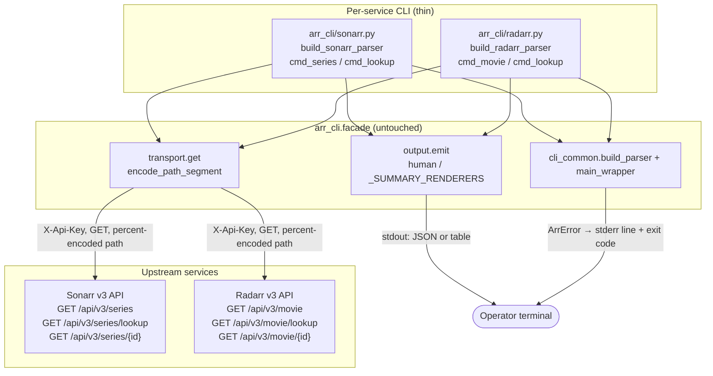
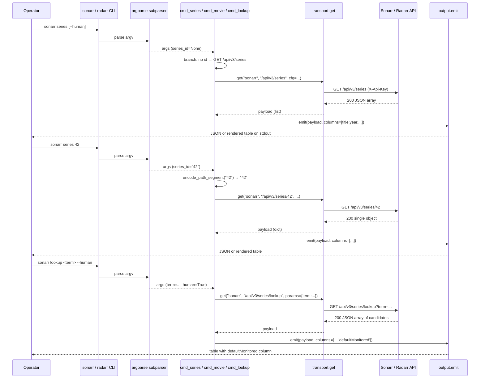

# Design Document

## Overview

Adds two read-only library-list invocations to `arr-cli` and
clarifies that the `monitored` field on the existing `lookup`
records is a **source default** (TVDB for Sonarr, TMDB for
Radarr), not the operator's library state.

New invocations:

* `sonarr series` (no id) → `GET /api/v3/series` (REQ-1).
* `radarr movie` (no id) → `GET /api/v3/movie` (REQ-2).

Existing `sonarr series <id>` / `radarr movie <id>` are
preserved unchanged (REQ-3). The only behavioural change to
`lookup` is the `--human` column rename `monitored` →
`defaultMonitored` on both CLIs (REQ-4); the raw JSON exposed by
`--verbose` and the unflagged default still carries the
`monitored` key exactly as the upstream API returns it (REQ-4
AC4).

Scope:

1. `arr_cli/sonarr.py` — make `series_id` positional optional;
   branch `cmd_series` on whether it was supplied.
2. `arr_cli/radarr.py` — same shape: `movie_id` becomes
   optional; `cmd_movie` branches.
3. `cmd_lookup` in both files — rename the column to
   `defaultMonitored`; append the verbatim REQ-5 source-default
   phrase to the docstring.
4. `tests/unit/test_sonarr.py` / `test_radarr.py` — pin the new
   routing, the renamed column, and regression-safety of the
   single-fetch path with `unittest.mock.patch` on
   `transport.get` (REQ-7).
5. Sandbox-side `SKILL.md` lookup recipes (REQ-6) — no
   `media-cli/SKILL.md` exists in this sandbox; documented as a
   follow-up for operator workspaces.

All other modules (transport, output, config, errors, retry,
parser) are untouched. The renderer priority chain
(`--human` > `--verbose` > summary > verbatim) is unchanged.

## Project Alignment

### Technical Standards

- **Read-only.** Both endpoints are HTTP `GET`. No write paths
  (`AGENTS.md §1`).
- **Facade-only plumbing.** All HTTP via
  `arr_cli.facade.transport.get`, auth via `_inject_auth`,
  percent-encoding via `transport.encode_path_segment`,
  rendering via `output.emit`. Per-service modules stay thin
  (`AGENTS.md §4.3`).
- **Stable exit codes.** Errors propagate through
  `main_wrapper` unchanged (`ConfigError=1`, `AuthError=2`,
  `NetworkError=3`, `HttpError=4`, `ParseError=5` —
  `AGENTS.md §6`).
- **Python ≥ 3.11 idioms.** No new syntax; existing PEP 604
  unions / `match` patterns continue to apply.
- **Type hints on public functions.** `cmd_series`, `cmd_movie`,
  `cmd_lookup` keep the existing
  `(args: argparse.Namespace, cfg: ServiceConfig) -> int` shape.
- **Two-space indent, no tabs, no new runtime deps.**
- **stdout pipe-cleanliness** — JSON on stdout, diagnostics on
  stderr — preserved automatically because no new error path
  is added.

### Project Structure

The change touches exactly two per-service CLIs (thin command
tables — `AGENTS.md §4.2`) and the two corresponding unit-test
files. No facade module changes. No `pyproject.toml` changes
(no new deps, no new console scripts, no new entry points).
No `arr.conf.example` changes (no new config keys — the library
endpoints require no per-call parameters beyond the auth-laden
base URL).

The new branches in `cmd_series` / `cmd_movie` keep the existing
handler signature; the only adjustment is making the positional
optional in the subparser and branching on
`getattr(args, "series_id", None)`. This mirrors the pattern used
by `cmd_lookup` (optional `term`) and `cmd_calendar` (optional
`start`/`end`).

## Code Reuse Analysis

### Existing Components to Leverage

- **`arr_cli.facade.transport.get`** (`arr_cli/facade/transport.py`):
  Already handles auth injection, query percent-encoding,
  timeouts, retry, debug redaction, and the typed-error mapping
  (`AuthError`, `HttpError`, `NetworkError`, `ParseError`). The
  new library-list calls reuse it verbatim.
- **`arr_cli.facade.transport.encode_path_segment`**: The
  existing `cmd_series` / `cmd_movie` percent-encode the id
  before splicing into `/api/v3/{series,movie}/{id}`. The no-id
  branch has no path segment to encode; REQ-3 AC3 stays
  satisfied.
- **`arr_cli.facade.output.emit`** (`arr_cli/facade/output.py`):
  Used unchanged. The new library-list endpoints are *not*
  registered in `_SUMMARY_RENDERERS`, so they take the verbatim
  default for unflagged and `--verbose` paths (the documented
  graceful default). `--human` renders `human(..., columns=...)`
  directly on the verbatim payload; `_row_from_mapping` handles
  the flat keys without nested-walk changes.
- **`arr_cli.facade.cli_common.build_parser` and `main_wrapper`**
  (`arr_cli/facade/cli_common.py`): Used unchanged. The new
  optional positional is registered by adding
  `nargs=argparse.OPTIONAL` to the `series` / `movie`
  subparsers' `add_argument("series_id", ...)` call.
- **Existing subparser pattern** (`arr_cli/sonarr.py` lines
  309–331; `arr_cli/radarr.py` lines 297–319): `lookup.term`
  already uses `nargs=argparse.OPTIONAL`; the same pattern is
  applied to `series_id` / `movie_id`.

### Integration Points

- **Sonarr / Radarr API v3** (external): `GET /api/v3/series`
  and `GET /api/v3/movie` are documented v3 endpoints returning
  the full library as a JSON array. Authenticated via
  `X-Api-Key`, which the facade already injects
  (`transport._HEADER_NAMES`).
- **`_SUMMARY_RENDERERS` dispatch table**: Deliberately *not*
  extended for the new commands. A full-library dump is the
  canonical verbatim payload — the per-row summary shape used
  by `wanted` / `queue` / `recent` would lose information. The
  unflagged default emits verbatim JSON, `--verbose` is a
  no-op, `--human` renders a curated column view.
- **Test helpers** (`tests/unit/test_sonarr.py` /
  `test_radarr.py`): Reuse `_service_config`, `_namespace`,
  `_patched_get_payload`, `_patched_get_raising`,
  `_capture_stdout`, `_capture_stderr_stdout` without
  modification. Existing `TestCmdSeries` / `TestCmdMovie` are
  extended with no-id tests; the single-id tests stay put
  (REQ-7 AC2 / AC4 regression-safety).
- **Sandbox-side `SKILL.md` recipes**: No `media-cli/SKILL.md`
  exists in this sandbox (`find / -path '*media-cli/SKILL.md'`
  returns nothing). REQ-6 is a documentation follow-up: when an
  operator workspace contains the recipe, the Sonarr / Radarr
  `lookup` sections must call out the source-default
  semantics. Mirrors the prior `human-tracks-default-shape`
  design's REQ-6 sandbox no-op outcome.

## Architecture

## Components and Interfaces

### Component 1 — `arr_cli.sonarr.build_sonarr_parser` (modified)

- **Purpose:** Register the `series` subcommand with an optional
  positional id (REQ-1 / REQ-3).
- **Interfaces:** Existing
  `build_sonarr_parser() -> argparse.ArgumentParser`, with one
  modified `add_argument` call (positional `series_id` becomes
  `nargs=argparse.OPTIONAL`).
- **Dependencies:** `argparse`,
  `arr_cli.facade.cli_common.build_parser`.
- **Reuses:** The same `argparse.OPTIONAL` pattern that
  `lookup.term` already uses in the same file.

### Component 2 — `arr_cli.sonarr.cmd_series` (modified)

- **Purpose:** Dispatch `GET /api/v3/series` (no id) or
  `GET /api/v3/series/{id}` (id supplied).
- **Interfaces:** `(args: argparse.Namespace, cfg: ServiceConfig)
  -> int` (signature unchanged).
- **Dependencies:** `arr_cli.facade.transport` (`get`,
  `encode_path_segment`); `arr_cli.facade.output` (`emit`).
- **Reuses:** Existing `_get` and `_emit` helpers.

Branch: when `getattr(args, "series_id", None)` is truthy,
`_get(f"/api/v3/series/{encode_path_segment(id)}", ...)`;
otherwise `_get("/api/v3/series", ...)`. `--human` columns
exactly `["title", "year", "monitored", "status", "tvdbId",
"seasons"]` (REQ-1 AC2). `monitored` stays as-is here — it is
the operator's *library* flag on a library row; REQ-4 only
renames the column on `lookup` records (source candidates).

### Component 3 — `arr_cli.sonarr.cmd_lookup` (modified)

- **Purpose:** Forward the lookup term unchanged; render the
  source-default column as `defaultMonitored` (REQ-4);
  document source-default semantics in the docstring (REQ-5).
- **Interfaces:** Signature unchanged.
- **Dependencies / Reuses:** Unchanged.

`columns` becomes `["title", "year", "tvdbId", "tvMazeId",
"defaultMonitored"]`. Docstring appends the verbatim REQ-5
phrase: *"the `monitored` field on these records is the source
default (TVDB for Sonarr, TMDB for Radarr), not the user's
library state"*. The JSON path is untouched:
`_SUMMARY_RENDERERS` has no entry for `("sonarr", "lookup")`,
so the unflagged default and `--verbose` both emit the verbatim
upstream payload — which still carries the literal `monitored`
key (REQ-4 AC4).

### Component 4 — `arr_cli.radarr.build_radarr_parser` (modified)

- **Purpose:** Make the `movie_id` positional optional (mirrors
  Component 1).
- **Interfaces / Dependencies / Reuses:** Same as Component 1.

### Component 5 — `arr_cli.radarr.cmd_movie` (modified)

- **Purpose:** Branch on whether `movie_id` was supplied
  (mirrors Component 2).
- **Interfaces / Dependencies / Reuses:** Same as Component 2.
- Columns: `["title", "year", "monitored", "status", "tmdbId",
  "imdbId"]` (REQ-2 AC2; `monitored` = operator's library flag).

### Component 6 — `arr_cli.radarr.cmd_lookup` (modified)

- **Purpose:** Mirror Component 3 on the Radarr side.
- **Interfaces / Dependencies / Reuses:** Same as Component 3.
- Columns: `["title", "year", "tmdbId", "imdbId",
  "defaultMonitored"]`.

### Component 7 — Sandbox-side SKILL.md recipes (follow-up)

- **Purpose:** When `media-cli/SKILL.md` exists in an operator
  workspace, the Sonarr and Radarr `lookup` recipes must call
  out the source-default semantics of the `monitored` column
  (REQ-6).
- **Interfaces / Dependencies:** None (documentation only).
- **Status:** **Sandbox no-op.** Documented as a follow-up
  chore; verification is by inspection of operator-workspace
  files when they exist.

## Data Models

**Sonarr library row** (`GET /api/v3/series`) — surfaced columns:
`title` (str), `year` (int), `monitored` (bool, **library** flag,
not the source default), `status` (str, e.g. `continuing`/`ended`),
`tvdbId` (int), `seasons` (list[Season], rendered as `<N items>`
via `_stringify` so the column stays compact). Other fields
(`tvMazeId`, `tvRageId`, `imdbId`, …) are not surfaced.

**Radarr library row** (`GET /api/v3/movie`) — surfaced columns:
`title` (str), `year` (int), `monitored` (bool, **library** flag),
`status` (str, e.g. `released`/`inCinemas`), `tmdbId` (int),
`imdbId` (str). Other fields (`runtime`, `genres`, …) are not
surfaced.

**Lookup candidate row** (`/api/v3/{series,movie}/lookup`) —
includes `monitored` (bool, **source default**: TVDB for Sonarr,
TMDB for Radarr), which is *not* the operator's library state.
For `--human` rendering the column is renamed to
`defaultMonitored`; the underlying JSON still exposes `monitored`
keyed exactly as the upstream API returns it (REQ-4 AC4). No
document-level renaming.

Critical distinction: REQ-4 only renames the column on the
`lookup` endpoint. On the library-list endpoints the `monitored`
column is the operator's library flag and keeps its original
name. `seasons` is rendered with the `<N items>` summary so a
long season list does not blow up the column width budget;
operators wanting season detail use `sonarr series <id> --human`.

## Error Handling

The new endpoints introduce **no new error class** and **no new
error-handling code path**; every error flows through the
existing typed errors mapped to the documented exit codes
(`AGENTS.md §6`).

| # | Trigger | Class | Exit | Handling | User impact |
|---|---|---|---|---|---|
| 1 | HTTP 401/403 | `AuthError` | 2 | `transport.get` raises; `main_wrapper` formats stderr line. Same path for both branches. | Exit 2; stderr names service, path, status; remediation hint about `arr.conf`. |
| 2 | Other 4xx/5xx | `HttpError` | 4 | `transport.get` raises with `status`; 500-char body excerpt. | Exit 4; stderr shows path + excerpt; retry via `--retry`. |
| 3 | Invalid JSON | `ParseError` | 5 | `transport.get` raises with byte offset of first failure. | Exit 5; stderr names path + offset. |
| 4 | DNS / connect / TLS / timeout | `NetworkError` | 3 | `transport.get` raises; `cfg.retry` × `cfg.deadline` absorbs transient. | Exit 3 if retries exhaust; raise `--retry`/`--deadline`/`--read-timeout`. |
| 5 | Missing / wrong-perm / unknown-format config | `ConfigError` | 1 | `main_wrapper` raises before handler runs. | Exit 1; stderr names the config issue. |
| 6 | Unknown subcommand (`sonarr series --bogus`) | argparse `SystemExit` | 2 | `parse_args` calls `sys.exit(2)` with usage hint. | Exit 2 with the standard argparse usage line. |

Verified by the existing transport test suite plus the new
fixture-based endpoint tests (REQ-7 AC7).

## Testing Strategy

### Unit Testing

All new tests live in the existing `tests/unit/test_sonarr.py`
and `tests/unit/test_radarr.py` files and reuse the existing
helpers (`_service_config`, `_namespace`,
`_patched_get_payload`, `_patched_get_raising`,
`_capture_stdout`, `_capture_stderr_stdout`). No live HTTP —
every new test stubs `arr_cli.facade.transport.get` with
`unittest.mock.patch`. Hermetic, under the 2-second cold-start
budget (NFR-Performance).

**Sonarr additions** (`tests/unit/test_sonarr.py`):

- `TestCmdSeries` — extend with no-id tests:
  - `test_series_no_id_hits_series_list_path` (REQ-1 AC1, REQ-7
    AC1): `args = _namespace()`; assert path is
    `"/api/v3/series"` with no `params`.
  - `test_series_no_id_emits_list_payload`: canned array
    round-trips through `output.emit` verbatim.
  - `test_series_no_id_human_renders_table` (REQ-1 AC2):
    `human=True`; assert `columns == ["title", "year",
    "monitored", "status", "tvdbId", "seasons"]` exactly.
  - `test_series_no_id_row_count_matches_payload` (REQ-1 AC3):
    canned payload of N items; rendered output has N data rows.
  - Existing `test_series_hits_series_path` is the regression
    pin (REQ-3 AC1, REQ-7 AC2).
- `TestCmdLookup` (or new
  `TestLookupDefaultMonitoredColumn`):
  - `test_lookup_human_default_monitored_column` (REQ-4 AC1,
    REQ-7 AC5): canned payload `[{"title": "X", "monitored":
    true}]`; assert `columns` contains `"defaultMonitored"`
    and does NOT contain the bare string `"monitored"`.
  - `test_lookup_json_keeps_monitored_key` (REQ-4 AC4):
    `human=False, verbose=True`; canned payload round-trips
    unchanged (literal `monitored` key still present).
- `TestBuildSonarrParser`:
  - `test_series_parses_without_id` (NEW): `parser.parse_args(
    ["series"])` succeeds; `args.series_id is None`.
  - `test_series_parses_with_id` already exists.

**Radarr additions** (`tests/unit/test_radarr.py`) — mirror
Sonarr:

- `TestCmdMovie` — extend with no-id tests (`test_movie_no_id_*`
  matching the Sonarr names), with columns equal to `["title",
  "year", "monitored", "status", "tmdbId", "imdbId"]` (REQ-2
  AC2). Existing `test_movie_hits_movie_path` is the regression
  pin (REQ-3 AC2, REQ-7 AC4).
- `TestCmdLookup`: `test_lookup_human_default_monitored_column`
  (REQ-4 AC2, REQ-7 AC6) and
  `test_lookup_json_keeps_monitored_key` (REQ-4 AC4).
- `TestBuildRadarrParser`: `test_movie_parses_without_id` (NEW).

**Fixture / endpoint exercise** (REQ-7 AC7): no-id tests use a
canned JSON array of two full series / movie objects
(mirroring the upstream schema); with-id regression tests reuse
the existing single-id canned payload (`{"title": "The
Expanse"}` for Sonarr, `{"title": "The Matrix"}` for Radarr).

### Integration Testing

No new integration tests. The two endpoints follow the same
authentication / path-encoding / JSON-decoding contract as every
other command; the existing `tests/integration/test_sonarr.py`
and `tests/integration/test_radarr.py` (gated by
`skip_unless_run_integration` and `ARR_RUN_INTEGRATION=1`)
already exercise live endpoints. Per `AGENTS.md §7.6`
integration tests are never chained into `make ci`.

### Smoke / CI (REQ-8)

- `make ci` (`== make test && make secret-scan && make
  smoke-dry`): no change; the new no-id invocations are
  exercised by the existing unit-test infrastructure.
- `make lint` (`py_compile` sweep): no change; the new
  branches use only existing syntax.
- `scripts/smoke.sh --dry-run`: the dry-run grammar check
  invokes `sonarr --help` and `radarr --help`; both `--help`
  outputs already list `series` and `movie` (the new
  optional-id variant shows the same help text because argparse
  renders `metavar` once). No change required.
- `scripts/secret-scan`: no new placeholder patterns; no
  hardcoded URLs or keys.

### Sandbox-Side SKILL.md Verification (REQ-6)

`find / -path "*media-cli/SKILL.md"` returns no results in this
sandbox. REQ-6 acceptance criteria are documented as a follow-up
rather than verified by automated test. When an operator
workspace contains `media-cli/SKILL.md`, the Sonarr and Radarr
`lookup` recipes must include the source-default callout;
Component 7 is the canonical wording.