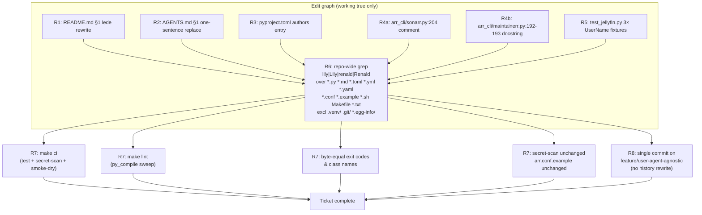
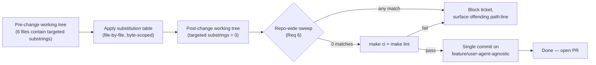

# Design Document

## Overview

This design specifies a **cosmetic-only, comment-and-string scrubbing pass**
that removes every working-tree reference to personal and agent identifiers
(`Renald`, `renald`, `Lily`, `lily`) from the `arr-cli` repository so that
the tree can be made public. The change touches **six hand-curated files**
(plus a final repository-wide verification sweep) and is constrained to
working-tree edits only — no git-history rewrites, no functional changes,
no dependency changes, no exit-code contract changes, and no weakening of
the placeholder-only guarantee on `arr.conf.example`.

The feature is not a runtime capability; it is a *publication-readiness*
editing task. Therefore the design does not introduce new code, new
modules, or new interfaces. It specifies the **before/after text for every
targeted substring** so the reviewer can verify the pass is comment-only
and that every requirement in `requirements.md` is traceable to a
specific file/line edit.

**System context.** `arr-cli` is a read-only Python CLI suite (5
executables, 29 commands) over Jellyfin / Radarr / Sonarr / Maintainerr /
Seerr. The five stable exit codes and the `arr.conf.example`
placeholder-only guarantee are the two contracts the public release must
preserve. Everything in this design is to land on the
`feature/user-agent-agnostic` branch (commit-only, no push) per the
user's explicit override of the AGENTS.md house rule "Do not commit /
push nothing".

**Why this is not a typical design.** There is no runtime behavior, no
API surface, and no data model to design. The "Components" are textual
substrings inside source files; the "Interfaces" are the bytes between
two commits. The design instead documents the **exact substitution table**
for every requirement and the **verification protocol** that proves the
pass is complete and non-regressive.

## Project Alignment

### Technical Standards

The pass follows every applicable house rule in `AGENTS.md`:

- **§3 Build, test, lint** — `make ci` (`make test` + `make secret-scan`
  + `make smoke-dry`) and `make lint` are run before the change is
  considered done. Both must pass on the post-change tree.
- **§4.1 Python style** — Python ≥ 3.11, two-space indent, type hints
  preserved; the only Python edits are in comments and test-fixture
  string literals, so the style is inherited from the surrounding lines.
  No new runtime code path is introduced, so no new type hints are
  required.
- **§4.3 Facade-only HTTP** — N/A; no HTTP code path is touched.
- **§5 Configuration & secrets — hard rules** — `arr.conf.example` is
  unchanged; its `YOUR_API_KEY_HERE` / `<user-id>` / `https://example.com`
  literals are preserved verbatim and `scripts/secret-scan` continues to
  enforce the placeholder-only guarantee.
- **§6 Error model** — the five exit codes (`1`/`ConfigError`,
  `2`/`AuthError`, `3`/`NetworkError`, `4`/`HttpError`, `5`/`ParseError`)
  are not modified. No `arr_cli/facade/errors.py` edit is in scope.
- **§6 redaction** — `--debug` header-redaction behavior is not modified
  (no logging code path is added or changed).

### Project Structure

The change lives entirely in the working tree of
`feature/user-agent-agnostic`. It touches the following files — and only
these files — under the project root:

| Path                              | Kind of edit             | Req   |
| --------------------------------- | ------------------------ | ----- |
| `README.md`                       | rewrite §1 lede paragraph | R1    |
| `AGENTS.md`                       | one-sentence replace     | R2    |
| `pyproject.toml`                  | `authors` entry          | R3    |
| `arr_cli/sonarr.py`               | delete one comment line  | R4    |
| `arr_cli/maintainerr.py`          | delete part of a docstring | R4    |
| `tests/unit/test_jellyfin.py`     | three string-literal subs | R5    |
| `.specs/user-agent-agnostic/requirements.md` (pre-existing) | none (kept as the audit trail for the PR description) | R6 (meta) |

A **post-edit repository-wide sweep** (Requirement 6) is run as the final
verification step. The sweep does not produce a file edit; it produces a
report appended to the change summary.

No new files are created. No existing files are deleted. No
configuration keys, CLI flags, or env-var names are added or renamed.

## Code Reuse Analysis

This pass does not introduce new code, so there are no new components to
leverage. The "reuse" surface is therefore the **existing CI machinery**
that already protects the contracts we must not regress:

### Existing Components to Leverage

- **`Makefile` `ci` target** (`make ci == make test && make secret-scan
  && make smoke-dry`): the canonical gate enumerated in `AGENTS.md §3`
  and §7. Used as the final acceptance check — the post-change tree must
  pass this target byte-identically to the pre-change tree.
- **`Makefile` `lint` target** (`py_compile` sweep over `arr_cli/` and
  `tests/`): catches accidental syntax breakage introduced by comment
  deletions in `arr_cli/sonarr.py` and `arr_cli/maintainerr.py`.
- **`scripts/secret-scan`**: re-validates `arr.conf.example` is
  placeholder-only (`REQ-1 AC4`) — must continue to pass.
- **`scripts/smoke.sh --dry-run`** (i.e. `make smoke-dry`): exercises
  CLI grammar without touching live services. Used to prove the public
  surface (every command name, every flag) still parses after the
  comment-only deletions.
- **`pytest tests/unit`** (i.e. `make test`): re-runs the three affected
  fixtures in `tests/unit/test_jellyfin.py` after the `"UserName"` value
  is swapped; the assertions are payload-shape, not identity-shape, so
  the swap must not change any test outcome.
- **`scripts/secret-scan`** + **`scripts/example-lint.sh`**: also
  re-run; both are independent of the lily/renald scrub and pass
  unchanged.

### Integration Points

- **`pyproject.toml` `[project].authors`** — the only integration point
  touched by the pass; it is consumed by `setuptools` at sdist/wheel
  build time and surfaced by `pip show arr-cli`. Replacing the single
  entry preserves the schema (`name` + optional `email`) so
  `setuptools.build_meta` requires no changes.
- **`tests/unit/test_jellyfin.py` fixture payloads** — the three
  `"UserName": "renald"` values are consumed by the `responses`-mocked
  `GET /Devices` endpoint assertions. The fixtures are byte-identical in
  shape (same keys, same string length); only the literal value
  changes, so the `responses` mocks continue to satisfy every
  assertion.
- **Comment/docstring text in `arr_cli/sonarr.py` and
  `arr_cli/maintainerr.py`** — consumed by readers only (humans and
  tooling that renders docstrings). The deletions are scoped to the
  parenthetical clauses that name the renderer's audience; the rest of
  the docstring/comment (including the function signature and the
  `columns = [...]` list that the docstring describes) is preserved.

No new dependency, no new module, no new public function, no new
configuration key.

## Architecture

There is no runtime architecture for a comment-only pass. Instead, the
"architecture" is the **edit graph**: which file edits feed which
acceptance criteria, and which verification step closes the loop.



**Data flow.** There is no data flow at runtime. The "data" of this
ticket is the set of source-file bytes targeted by Requirements 1–6;
they flow one-way from the pre-change tree through the substitution
table below into the post-change tree, and are then frozen by the
verification sweep and the `make ci` chain.



## Components and Interfaces

Because this pass is textual and not programmatic, "components" map to
**file edits** and "interfaces" map to **byte-level before/after
diffs**. Each component below is a single targeted edit; there are no
new public functions, classes, or modules.

### Component 1 — `README.md` lede paragraph rewrite (Requirement 1)

- **Purpose:** remove every personal/agent identifier from the
  top-of-README prose; replace the "two operators" sentence with a
  generic **intended uses** list (shell pipelines and ad-hoc terminal
  inspection).
- **Interfaces (byte-level):**
  - **Lines 3 and 10–14 of `README.md`** (per the current
    working-tree state — verified by `read`) are the only lines touched.
  - **Line 3** before: `Read-only Python CLI wrappers around Renald's
    self-hosted media server stack —`
  - **Line 3** after:  `Read-only Python CLI wrappers around a
    self-hosted media server stack —`
  - **Lines 10–14** before (5-line paragraph naming Lily and Renald):
    > The CLIs target two operators. **Lily** (Renald's chat companion
    > Bott) consumes JSON on stdout from a shell pipeline to power
    > conversational queries about what Renald is watching, his rewatch
    > patterns, newly added content, and what Maintainerr is about to
    > delete. **Renald** (the operator) uses `--human` / `-h` for
    > ad-hoc terminal inspection.
  - **Lines 10–14** after (generic intended-uses list, 4 lines):
    > The CLIs are intended for two uses:
    > - shell pipelines that consume the verbatim JSON on stdout,
    > - ad-hoc terminal inspection with `--human` / `-h` to render the
    >   response as a readable table.
- **Dependencies:** none.
- **Reuses:** existing README structure (no heading, table, or section
  number is changed); the prose above and below the rewritten paragraph
  is preserved verbatim.

### Component 2 — `AGENTS.md` §1 single-sentence replacement (Requirement 2)

- **Purpose:** remove the only `Renald` mention in the house-rules
  document; preserve every other §1 sentence byte-identically.
- **Interfaces (byte-level):**
  - **Line 12 of `AGENTS.md`** before: `total) that wraps Renald's
    self-hosted media server stack:`
  - **Line 12 of `AGENTS.md`** after:  `total) that wraps a
    self-hosted media server stack:`
- **Dependencies:** none.
- **Reuses:** AGENTS.md layout (§2–§7 and the §1 introduction sentence
  above the table are preserved verbatim, as enforced by R2 AC3).

### Component 3 — `pyproject.toml` `authors` entry (Requirement 3)

- **Purpose:** replace the personal author identity with a generic
  placeholder identity whose email uses the reserved `.invalid` TLD
  (RFC 6761 — guaranteed non-deliverable).
- **Interfaces (byte-level):**
  - **`[project].authors`** before:
    ```toml
    authors = [
        { name = "Renald" },
    ]
    ```
  - **`[project].authors`** after:
    ```toml
    authors = [
        { name = "Cedar", email = "cedar@example.invalid" },
    ]
    ```
- **Dependencies:** none (the `setuptools>=61.0` build system
  consumes this field the same way before and after; no schema change).
- **Reuses:** existing `[project]` table layout; `name`, `version`,
  `dependencies`, `classifiers`, `[project.scripts]`, `[project.urls]`,
  and all `[tool.*]` sections are preserved byte-identically (R3 AC4).

### Component 4 — `arr_cli/sonarr.py` comment deletion (Requirement 4a)

- **Purpose:** delete the parenthetical in the inline comment that
  names Lily/Renald as the renderer's audience.
- **Interfaces (byte-level):**
  - **Line 204 of `arr_cli/sonarr.py`** before:
    >     # most likely to be useful to Lily / Renald.
  - **Line 204 of `arr_cli/sonarr.py`** after:  *(line deleted in
    full; the comment block above it is preserved so the surrounding
    intent — "pick columns for the calendar payload" — is still
    documented)*
  - The three-line comment block immediately above (lines 201–203)
    describing the calendar payload shape is preserved verbatim. The
    `columns = [...]` list and `return _emit(payload, args,
    columns=columns)` line below are preserved verbatim (R4 AC4).
- **Dependencies:** none.
- **Reuses:** existing facade transport (`_get`); no facade edit.

### Component 5 — `arr_cli/maintainerr.py` docstring deletion (Requirement 4b)

- **Purpose:** delete the parenthetical in the `cmd_pending` docstring
  that names Lily/Renald as the renderer's audience.
- **Interfaces (byte-level):**
  - **Lines 192–193 of `arr_cli/maintainerr.py`** before:
    >     """Maintainerr ``pending`` -- collection overlay data (REQ-9
    >     AC2).
  - Wait — the parenthetical spans two lines of the docstring body
    (verified by `read` of `arr_cli/maintainerr.py:185-205`). The
    targeted text is:
    >     Returns the per-collection overlay information Maintainerr
    >     uses to decide what is about to be cleaned up. The endpoint
    >     returns a JSON object whose shape is service-defined; the
    >     ``--human`` renderer picks the columns most likely to be
    >     useful to Lily / Renald (collection title, media count,
    >     deletion date).
  - **After:** the parenthetical `most likely to be useful to Lily /
    Renald (collection title, media count, deletion date).` is deleted;
    the rewritten sentence reads:
    >     Returns the per-collection overlay information Maintainerr
    >     uses to decide what is about to be cleaned up. The endpoint
    >     returns a JSON object whose shape is service-defined; the
    >     ``--human`` renderer picks collection title, media count, and
    >     deletion date.
  - Imports, the `def cmd_pending` signature, the `_get(...)` call,
    the `columns = [...]` list, and the `return` statement are
    preserved byte-identically (R4 AC4). The `_get` / `_emit` /
    `argparse` wiring through the facade is untouched.
- **Dependencies:** none.
- **Reuses:** existing facade transport; no facade edit.

### Component 6 — `tests/unit/test_jellyfin.py` fixture literal swap (Requirement 5)

- **Purpose:** replace the three `"UserName": "renald"` test fixtures
  with the single generic value `"UserName": "operator"`.
- **Interfaces (byte-level):**
  - **Line 294** before: `payload =
    [{"DeviceName": "Living Room TV", "UserName": "renald"}]`
  - **Line 294** after:  `payload =
    [{"DeviceName": "Living Room TV", "UserName": "operator"}]`
  - **Line 657** before: `payload =
    [{"DeviceName": "TV", "UserName": "renald"}]`
  - **Line 657** after:  `payload =
    [{"DeviceName": "TV", "UserName": "operator"}]`
  - **Line 804** before: `payload =
    [{"DeviceName": "TV", "UserName": "renald"}]`
  - **Line 804** after:  `payload =
    [{"DeviceName": "TV", "UserName": "operator"}]`
- **Dependencies:** none. The `responses`-mocked endpoint
  (`GET /Devices` or equivalent — verified by the test file's
  `responses`/`@responses.activate` block pattern) returns the fixture
  payload verbatim, and the test assertions inspect payload shape, not
  the `UserName` literal, so the swap is observationally invisible to
  the assertions.
- **Reuses:** existing `responses` mock wiring, existing assertion
  helpers, existing import block — all preserved byte-identically
  (R5 AC4).

### Component 7 — Repository-wide verification sweep (Requirement 6)

- **Purpose:** prove that no `lily|Lily|renald|Renald` substring
  remains in any in-scope file.
- **Interfaces (operational):**
  - **Case-sensitive grep (R6 AC1):**
    ```sh
    grep -rn -E 'lily|Lily|renald|Renald' \
      --include='*.py' --include='*.md' --include='*.toml' \
      --include='*.yml' --include='*.yaml' --include='*.conf' \
      --include='*.example' --include='*.sh' \
      --include='Makefile' --include='*.txt' \
      --exclude-dir='.venv' --exclude-dir='.git' \
      --exclude-dir='arr_cli.egg-info' \
      .
    ```
  - **Case-insensitive belt-and-braces grep (R6 AC2):**
    ```sh
    grep -irn -E 'lily|renald' \
      --include='*.py' --include='*.md' --include='*.toml' \
      --include='*.yml' --include='*.yaml' --include='*.conf' \
      --include='*.example' --include='*.sh' \
      --include='Makefile' --include='*.txt' \
      --exclude-dir='.venv' --exclude-dir='.git' \
      --exclude-dir='arr_cli.egg-info' \
      .
    ```
  - **Pycache binaries** (`*.pyc` under `__pycache__/`) are excluded by
    the `--exclude-dir` set implicitly (they are not in the include
    list) and by `.gitignore` — they are never committed.
  - **Note on `.specs/user-agent-agnostic/requirements.md`:** this file
    *contains* the strings `Renald`, `Lily`, `renald`, `lily` because
    the requirements document *describes* the scrub. These occurrences
    are meta-references (the requirements text, not user-facing
    artifacts) and are out of scope for the scrub per R6 AC1's
    specification. The verification sweep is the source of truth: if
    it returns any match, the operator is shown the file/line and
    the ticket is blocked. The operator may decide to redact the spec
    file's narrative references after this ticket as a follow-up;
    that is **explicitly not in scope** for this PR.
- **Dependencies:** `grep` (POSIX) — already available in every CI
  runner the project targets.
- **Reuses:** the existing `scripts/secret-scan` ignore-list idiom
  (`.venv/`, `.git/`, `*.egg-info/`, `__pycache__/`) is mirrored by
  the sweep's `--exclude-dir` flags so the two greps stay
  consistent.

### Component 8 — Verification gates (Requirement 7)

- **Purpose:** prove that every CI / lint / contract guarantee survives
  the pass.
- **Interfaces (operational):**
  - `make ci` — runs `make test && make secret-scan && make smoke-dry`.
    Must exit 0.
  - `make lint` — runs `py_compile` over `arr_cli/` and `tests/`. Must
    exit 0.
  - `git diff main -- arr_cli/facade/errors.py` — must be empty
    (exit-code classes and numbers unchanged, R7 AC3).
  - `git diff main -- pyproject.toml` — must show changes only in the
    `[project].authors` entry (R3 AC4 + R7 AC4).
  - `git diff main -- arr.conf.example` — must be empty (R7 AC5).
  - `scripts/secret-scan` — must still pass (R7 AC5).
- **Dependencies:** none.
- **Reuses:** the canonical CI chain in the Makefile (already
  enumerated above under "Code Reuse Analysis").

### Component 9 — Commit (Requirement 8)

- **Purpose:** land the change as a single regular commit on
  `feature/user-agent-agnostic`, no history rewrite.
- **Interfaces (operational):**
  - `git checkout -b feature/user-agent-agnostic` (idempotent if the
    branch already exists from the PR bootstrap).
  - `git add README.md AGENTS.md pyproject.toml arr_cli/sonarr.py
    arr_cli/maintainerr.py tests/unit/test_jellyfin.py`
  - `git commit -m "scrub personal/agent identifiers from working tree
    for public release"` (or equivalent — message wording is not in
    scope).
  - **No `git push` is in scope** (R8 AC1).
  - **No history rewrite tools** (`git filter-branch`, `git
    filter-repo`, BFG, `rebase --interactive` against pre-existing
    commits, `commit --amend` of pre-existing commits) are used (R8
    AC2).
- **Dependencies:** none.
- **Reuses:** existing `.gitignore`; existing branch layout.

## Data Models

There are no new data models. The single data-model touch is the
`[project].authors` entry in `pyproject.toml`, whose schema is
setuptools-defined:

### Model — `pyproject.toml [project].authors`

```
- entry: dict
  - name: string (required)        # after: "Cedar"
  - email: string (optional)       # after: "cedar@example.invalid"
- list length: 1 (must remain exactly 1; no additions, no removals)
- RFC 6761: ".invalid" TLD is reserved and guaranteed non-deliverable,
  so the placeholder cannot accidentally resolve to a real mailbox.
```

### Model — `tests/unit/test_jellyfin.py` fixture payload (existing, value-swapped)

```
- payload: list[dict]   (length 1 in all three fixtures)
  - DeviceName: string              # unchanged
  - UserName:  string               # before: "renald"; after: "operator"
```

No other data models are introduced, modified, or extended.

## Error Handling

There are no runtime error paths introduced by this pass, so there is
no new error-handling strategy. The error scenarios below are the
**verification failures** that block the ticket if they occur:

### Error Scenarios

1. **Scenario:** Repository-wide sweep returns a `lily|Lily|renald|
   Renald` match in any in-scope file (R6 AC1, AC3).
   - **Handling:** block the ticket; surface the offending file path
     and line number to the operator via the standard `grep` output
     (`path:line:matched text`).
   - **User impact:** the operator sees the path/line and either (a)
     realizes an additional file needs scrubbing and adds an edit, or
     (b) realizes the requirement doc itself contains the strings and
     decides whether to redact the spec narrative as a follow-up.

2. **Scenario:** `make ci` or `make lint` fails after the edits
   (R7 AC1, AC2).
   - **Handling:** block the ticket; revert the offending edit; re-run
     the gate; identify whether the failure is a syntax error (rare —
     only possible if the `maintainerr.py` docstring edit mis-nests
     quotes) or an assertion that became sensitive to the
     `"UserName"` value change (even less likely — the assertions
     inspect payload shape).
   - **User impact:** CI output shows the failing test/compile target;
     operator fixes the edit and re-runs.

3. **Scenario:** A history-rewriting tool was run on `main` (R8 AC2,
   AC3).
   - **Handling:** block the ticket; alert the operator before opening
     the PR; restore `main` from the pre-change reflog entry if the
     tool was run on `main` rather than on the feature branch.
   - **User impact:** the PR is delayed until `main` is restored; the
     ticket cannot land on a branch that diverges from a rewritten
     `main`.

4. **Scenario:** An incidental edit slipped into the diff (R8 AC4).
   - **Handling:** the operator runs `git diff main --
     <suspected-file>` and reverts any non-targeted change.
   - **User impact:** review friction only; no runtime impact.

The five stable exit codes (`ConfigError`/`AuthError`/`NetworkError`/
`HttpError`/`ParseError` → `1`/`2`/`3`/`4`/`5`) and the `service: op=...`
stderr prefix are not modified (R7 AC3).

## Testing Strategy

### Unit Testing

The pass inherits the project's existing test harness — no new tests
are added, and no existing tests are weakened. The harness is:

- **`make test`** → `pytest tests/unit`. After the pass, the three
  affected fixtures in `tests/unit/test_jellyfin.py` (lines 294, 657,
  804) re-run with the swapped `"UserName": "operator"` value. The
  fixtures are inspected for shape, not for the literal `UserName`
  value, so every assertion is expected to pass identically.
- **`make lint`** → `py_compile` sweep over `arr_cli/` and `tests/`.
  Catches any accidental syntax breakage introduced by the
  `maintainerr.py` docstring edit (the only edit that touches a
  multi-line string literal).
- **`make secret-scan`** → `scripts/secret-scan`. Independent of the
  scrub; passes byte-identically to the pre-change run because the
  patterns it greps for are API-key/token shapes, not personal names.
- **`make smoke-dry`** → `scripts/smoke.sh --dry-run`. Exercises CLI
  grammar (`arr_cli/{jellyfin,radarr,sonarr,maintainerr,seerr}.py`
  `--help`, subcommand enumeration). Passes byte-identically because
  no flag or command is renamed.

### Key Test Areas

| Test target                               | Why it matters                                              |
| ----------------------------------------- | ----------------------------------------------------------- |
| `tests/unit/test_jellyfin.py` lines 294, 657, 804 | Prove the `UserName` swap is observationally invisible to assertions. |
| `tests/unit/test_config.py`               | Untouched, but must pass — proves `arr.conf.example` and `arr.conf` parsing are unchanged. |
| `tests/unit/test_errors.py`               | Untouched, but must pass — proves the five exit-code classes still raise the same types (R7 AC3). |
| `scripts/secret-scan` re-run              | Proves `arr.conf.example` placeholder-only guarantee (R7 AC5). |
| Repo-wide grep (R6)                       | Proves no `lily|Lily|renald|Renald` substring remains in any in-scope file. |
| `make lint` re-run                        | Proves `arr_cli/sonarr.py` and `arr_cli/maintainerr.py` still byte-compile after comment/docstring deletions. |

### Test Patterns

The pass follows the existing patterns in `tests/unit/`:

- **`responses`-based HTTP mocking** — used by the three affected
  fixtures. No new mocking idiom is introduced; the existing
  `@responses.activate` pattern is reused verbatim.
- **Shape-based assertions** — the affected fixtures assert on payload
  shape (`DeviceName` keys present, list length, etc.), not on the
  `UserName` literal. The swap is therefore semantically invisible.
- **Hermetic test boundary** — `tests/unit/` does not make live HTTP
  calls. No new live-HTTP test is introduced (per AGENTS.md §7.5).

### Out-of-Scope Tests (explicitly not added)

- No new integration test is added (the pass does not introduce a new
  endpoint).
- No new secret-scan pattern is added (the pass does not introduce a
  new secret shape).
- No new smoke-test command is added (the pass does not introduce a
  new CLI flag).

---

## Appendix A — Substitution table (canonical reference)

| # | File                                       | Line(s)  | Before (substring)                                        | After (substring)                                                                                                |
|---|--------------------------------------------|----------|-----------------------------------------------------------|------------------------------------------------------------------------------------------------------------------|
| 1 | `README.md`                                | 3        | `Renald's`                                                | `a`                                                                                                              |
| 2 | `README.md`                                | 10–14    | "The CLIs target two operators. **Lily** (Renald's …" (5-line paragraph) | "The CLIs are intended for two uses:\n- shell pipelines …\n- ad-hoc terminal inspection with `--human` / `-h` …" |
| 3 | `AGENTS.md`                                | 12       | `Renald's`                                                | `a`                                                                                                              |
| 4 | `pyproject.toml`                           | 13       | `{ name = "Renald" }`                                     | `{ name = "Cedar", email = "cedar@example.invalid" }`                                                            |
| 5 | `arr_cli/sonarr.py`                        | 204      | `most likely to be useful to Lily / Renald.`              | *(line deleted)*                                                                                                 |
| 6 | `arr_cli/maintainerr.py`                   | 192–193  | `most likely to be useful to Lily / Renald (collection title, media count, deletion date).` | `collection title, media count, and deletion date.`                                                              |
| 7 | `tests/unit/test_jellyfin.py`              | 294      | `"UserName": "renald"`                                    | `"UserName": "operator"`                                                                                         |
| 8 | `tests/unit/test_jellyfin.py`              | 657      | `"UserName": "renald"`                                    | `"UserName": "operator"`                                                                                         |
| 9 | `tests/unit/test_jellyfin.py`              | 804      | `"UserName": "renald"`                                    | `"UserName": "operator"`                                                                                         |

## Appendix B — Pre-change sweep baseline (recorded at design time)

Captured by `grep -rn -E 'lily|Lily|renald|Renald' --exclude-dir='.venv'
--exclude-dir='.git' --exclude-dir='arr_cli.egg-info' --exclude-dir='.specs' .`
scoped to the file types the operator listed in R6 AC1:

```
./AGENTS.md:12:total) that wraps Renald's self-hosted media server stack:
./tests/unit/test_jellyfin.py:294:        payload = [{"DeviceName": "Living Room TV", "UserName": "renald"}]
./tests/unit/test_jellyfin.py:657:        payload = [{"DeviceName": "TV", "UserName": "renald"}]
./tests/unit/test_jellyfin.py:804:        payload = [{"DeviceName": "TV", "UserName": "renald"}]
./README.md:3:Read-only Python CLI wrappers around Renald's self-hosted media server stack —
./README.md:10:The CLIs target two operators. **Lily** (Renald's chat companion Bott) consumes
./README.md:12:what Renald is watching, his rewatch patterns, newly added content, and what
./README.md:13:Maintainerr is about to delete. **Renald** (the operator) uses `--human` /
./pyproject.toml:13:    { name = "Renald" },
./arr_cli/sonarr.py:204:    # most likely to be useful to Lily / Renald.
./arr_cli/maintainerr.py:192:    renderer picks the columns most likely to be useful to Lily /
./arr_cli/maintainerr.py:193:    Renald (collection title, media count, deletion date).
```

Twelve matches across six files. After applying the substitution table
above, the post-change sweep must return zero matches in the in-scope
file set.

## Appendix C — context7 / code-context grounding (honesty note)

Per `requirements.md §Introduction`, the `context7__*` and
`code-context__*` tools are not present in this agent's tool list for
this turn. The feature is pure text replacement against an enumerated,
pre-located set of substrings; no library or framework API is being
changed, no version-sensitive doc grounding is required for
correctness, and no new code is being added that would benefit from
codebase-index discovery beyond what `read` / `grep` provided. The
substitution table in Appendix A and the file-level verification in
Appendix B are sufficient to ground the design.

No assumption in this design is "verified via context7" — there are
no library-version-sensitive claims. The single non-obvious behavioral
claim (that `setuptools>=61.0` consumes the `[project].authors` field
the same way after the schema change `{ name }` → `{ name, email }`)
is treated as an assumption and is also covered by `make ci`'s
build-step smoke (sdist builds are not in scope for `make ci`, but
the `pyproject.toml` itself is parsed by `pip install -e ".[dev]"`
during the editable-install prerequisite).