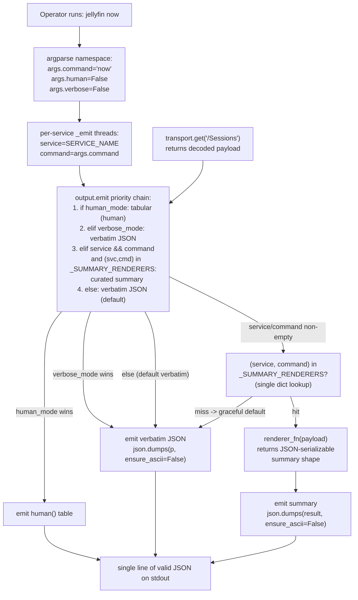

# Design Document

## Overview

This design flips `arr-cli`'s default stdout output for a curated set
of **size-to-summary candidate** commands from verbatim service JSON
to a **per-command summary** sized for chat-agent consumption, while
adding a `--verbose` flag that restores the pre-change verbatim
behaviour on demand (`option (a)` per workboard ticket
`6a4dfded-9944-47e7-ad86-59a712e93fb0`). The summary renderer lives
in `arr_cli/facade/output.py` as a third dispatch branch — sibling
to the existing JSON pass-through (`emit(... human_mode=False)`) and
tabular human (`emit(... human_mode=True)`) paths — so every
command picks up the priority chain (`--human` > `--verbose` >
default summary) without per-service forks. `--human` / `-h`
rendering stays exactly where it is; the `--debug` / `--quiet`
redaction and warning behaviour is unchanged; the five stable exit
codes and the pipe-clean stdout contract (single line of valid JSON
on stdout, diagnostics on stderr) are preserved byte-for-byte.
Out of scope: any new endpoint, any new exit code, any new runtime
dependency, any change to the verbatim payload shape, any change to
`--human` rendering.

## Project Alignment

### Technical Standards

- **Python ≥ 3.11** per `pyproject.toml::requires-python` and
  `AGENTS.md §4.1`. The renderer uses PEP 604 unions, stdlib
  `json`, and module-level `dict[str, Callable[[Any], Any]]`
  registrations; no syntax or stdlib features beyond the
  documented minimum.
- **Two-space indent**, no tabs, type hints on every public
  function (AGENTS.md §4.1). The new public functions
  (`output.summarize`, the per-command summary functions) follow
  the same `def name(...) -> ReturnType:` convention used by
  `output.human` and `output.emit`.
- **No new runtime dependencies** (AGENTS.md §4.1, NFR-Security).
  The renderer is plain `json` + dict comprehensions + safe
  subscript helpers; `pytest` and `responses` are already dev deps
  per `pyproject.toml`.
- **`py.typed` PEP 561 marker preserved.** The package ships
  `arr_cli/py.typed`; new public symbols declare their types so
  downstream type checkers see them.
- **No comments unless they explain non-obvious "why"** (AGENTS.md
  §4.1). The new docstrings are short and describe precedence or
  defensive behaviour, not mechanics.

### Project Structure

- The summary renderer lives **inside `arr_cli/facade/output.py`**
  alongside `human()` and `emit()`, per AGENTS.md §4.3 ("If a
  change touches more than one of the per-service CLIs, the right
  home is almost always `arr_cli/facade/`") and per REQ-6 AC2
  (the renderer is in the facade, not duplicated per service).
- Per-command summary functions live in `arr_cli/facade/output.py`
  in a single dispatch table keyed by `(service, command)` tuples,
  matching the architecture diagram in §"Architecture".
- The `--verbose` flag is registered in
  `arr_cli/facade/cli_common.py::build_parser` next to the existing
  `--human` / `-h` entry, following the universal-flag pattern
  (same `argparse.add_argument(...)` shape, same docstring style,
  same `store_true` action with `default=False`).
- Per-service CLIs (`jellyfin.py`, `radarr.py`, `sonarr.py`,
  `maintainerr.py`, `seerr.py`) get a **one-line touch** on
  their existing `_emit` helper (forwarding `args.verbose`,
  `service=SERVICE_NAME`, and `args.command` into
  `output.emit(...)`). The body of every command handler
  stays byte-identical. This preserves REQ-3 AC5 ("the logic
  SHALL NOT be scattered across per-service CLI files") —
  the priority chain lives in `output.emit` and the
  dispatch table lives in `output._SUMMARY_RENDERERS`; the
  per-service files are a thin pass-through only.
- New unit tests live under `tests/unit/` using `responses` for
  HTTP mocking — the hermetic contract of `AGENTS.md §7.5` is
  preserved.

## Code Reuse Analysis

### Existing Components to Leverage

- **`arr_cli.facade.output.emit`** — extend the dispatch with a
  third branch. The current signature already takes
  `human_mode: bool`; the new signature takes both
  `human_mode: bool` and `verbose_mode: bool` (added as a new
  keyword argument so existing call sites keep working). The
  precedence check is a single `if/elif` chain that mirrors the
  documented priority order. This is an **extend**, not a fork —
  every per-service `_emit(...)` call site picks up the new
  behaviour without code change.
- **`arr_cli.facade.output.human`** — the summary renderer lives
  parallel to this in the same module. The renderer follows the
  same "pure function returning a value, `emit` decides whether to
  `print` it" split that `human()` already uses.
- **`arr_cli.facade.cli_common.build_parser`** — extend with a
  `--verbose` flag using the same `parser.add_argument(...)`
  pattern as `--human`. Same `store_true`, same `default=False`,
  same `metavar`-less shape; the only differences are the flag
  name, the docstring text, and the lack of a short alias (REQ-2
  AC5: "no short alias").
- **`arr_cli.facade.cli_common.main_wrapper`** — unchanged.
  `args.verbose` flows through `argparse` into the per-service
  `_emit` helpers exactly the way `args.human` does today; the
  wrapper does not need to know about the new flag.
- **Per-service `_emit` helpers** in `jellyfin.py`, `radarr.py`,
  `sonarr.py`, `maintainerr.py`, `seerr.py` — extend each
  from
  `output.emit(payload, human_mode=bool(args.human), ...)` to
  `output.emit(payload, human_mode=bool(args.human),
  verbose_mode=bool(args.verbose), service=SERVICE_NAME,
  command=str(args.command or ""), ...)`. The body of every
  command handler stays byte-identical; only the `_emit` helper
  is touched. This is the **one** seam per service that picks
  up the new flag and threads `(service, command)` into the
  `_SUMMARY_RENDERERS` lookup, by design.
- **`json.dumps` with `ensure_ascii=False`** — reused unchanged
  for the summary path. The pipe-clean stdout contract (REQ-5 AC3,
  REQ-3 AC5) is preserved by the same call.
- **`arr_cli.facade.errors.ArrError` hierarchy** — unchanged.
  The summary renderer is downstream of the facade, so HTTP
  failures never reach it; this is the same reason `human()`
  never sees a raw HTTP error today.

### Integration Points

- **Renderer dispatch seam.** `output.emit` is the single
  audit-point for renderer selection. Adding a new summary
  candidate is a one-line change to the dispatch table
  (`_SUMMARY_RENDERERS[(service, command)] = renderer_fn`).
- **CLI flag registration seam.** `cli_common.build_parser` is the
  single registration point for the universal flag set. The
  `--verbose` entry is registered once; every per-service parser
  inherits it via the existing `build_parser(...)` call.
- **Per-command call seam.** Each per-service CLI has a single
  `_emit` helper that calls `output.emit`. Five `_emit` helpers
  total — one per service. They are the only per-service sites
  touched.
- **HTTP transport seam.** Untouched. `transport.get` continues
  to return the verbatim service payload; the renderer is a
  downstream consumer of that payload, never an HTTP caller.

## Architecture



```mermaid
graph TD
    subgraph per-service CLI
        J[jellyfin.py - _emit<br/>service='jellyfin', command=args.command]
        R[radarr.py - _emit<br/>service='radarr', command=args.command]
        S[sonarr.py - _emit<br/>service='sonarr', command=args.command]
        M[maintainerr.py - _emit<br/>service='maintainerr', command=args.command]
        SE[seerr.py - _emit<br/>service='seerr', command=args.command]
    end

    subgraph cli_common
        BC[build_parser<br/>+ --verbose entry]
        MW[main_wrapper<br/>unchanged]
    end

    subgraph facade/output
        EMIT[emit<br/>priority chain<br/>accepts service+command kwargs]
        HUMAN[human<br/>tabular renderer]
        SUMM[summarize<br/>dispatch lookup<br/>graceful default: payload unchanged]
        TABLE[_SUMMARY_RENDERERS<br/>dict[(svc,cmd), fn]<br/>15 entries, module-level]
        SUMM_FN[per-command summary fns:<br/>_summary_jellyfin_now, ...]
    end

    subgraph facade
        T[transport.get<br/>unchanged]
    end

    BC -->|"args.verbose"| J
    BC --> R
    BC --> S
    BC --> M
    BC --> SE
    MW --> BC

    J -->|"payload, service, command"| EMIT
    R -->|"payload, service, command"| EMIT
    S -->|"payload, service, command"| EMIT
    M -->|"payload, service, command"| EMIT
    SE -->|"payload, service, command"| EMIT

    EMIT -->|"human_mode"| HUMAN
    EMIT -->|"verbose_mode OR no candidate"| JSON_PATH[json.dumps]
    EMIT -->|"summary candidate"| SUMM

    SUMM -->|"(svc,cmd) key"| TABLE
    TABLE -->|"renderer_fn(payload)"| SUMM_FN
    SUMM_FN -->|"JSON-serializable value"| JSON_PATH
    SUMM -->|"miss -> payload unchanged"| JSON_PATH

    J --> T
    R --> T
    S --> T
    M --> T
    SE --> T
```

## Components and Interfaces

### Component 1: `arr_cli.facade.output.emit` (extended)

- **Purpose:** Single entry point for stdout rendering and the
  single audit point for renderer selection. The current
  contract renders either verbatim JSON (`human_mode=False`) or
  the tabular human view (`human_mode=True`). The new contract
  adds a third branch — the curated per-command summary —
  selected by a `(service, command)` lookup in the
  `_SUMMARY_RENDERERS` table. Precedence is enforced inside
  `emit` as the documented chain `--human` > `--verbose` >
  default summary (REQ-3 AC1–AC4).
- **Interfaces:** Public signature becomes
  ```python
  def emit(
      payload: Any,
      *,
      human_mode: bool,
      verbose_mode: bool = False,
      service: str = "",
      command: str = "",
      columns: Sequence[str] | None = None,
      limit: int = DEFAULT_LIMIT,
      max_width: int = DEFAULT_MAX_WIDTH,
      stream: Any | None = None,
  ) -> None: ...
  ```
  Threading decision: the `(service, command)` pair is passed in
  as two **keyword-only** parameters that default to empty
  strings. The summary branch fires only when **both**
  `service` and `command` are non-empty **and** the
  `(service, command)` tuple is a key in the
  `_SUMMARY_RENDERERS` table. When either is empty (or the key
  is not in the table), the summary branch is skipped and the
  default verbatim pass-through runs — this is the documented
  graceful default and preserves byte-for-byte the existing
  behaviour for any caller that does not pass `service` /
  `command` (REQs 1, 2, 3 AC1–AC4; NFR-Reliability).

  Concretely, the priority chain inside `emit` reads as:

  ```python
  if human_mode:
      rendered = human(payload, columns=columns, limit=limit, max_width=max_width)
      print(rendered, file=out)
      return
  if verbose_mode:
      print(json.dumps(payload, ensure_ascii=False), file=out)
      return
  if service and command and (service, command) in _SUMMARY_RENDERERS:
      rendered = summarize(service, command, payload)
      print(json.dumps(rendered, ensure_ascii=False), file=out)
      return
  print(json.dumps(payload, ensure_ascii=False), file=out)
  ```

  The two new parameters are keyword-only with safe sentinels,
  so all existing call sites that don't pass them continue to
  work unchanged — the summary branch is opt-in per caller and
  the default verbatim pass-through is preserved byte-for-byte
  for non-candidate commands (REQ-5 AC3, NFR-Reliability).
- **Dependencies:** `arr_cli.facade.output.human`,
  `arr_cli.facade.output.summarize`, the module-level
  `_SUMMARY_RENDERERS` dispatch table, `json.dumps`,
  `sys.stdout`.
- **Reuses:** The existing JSON pass-through path
  (`json.dumps(payload, ensure_ascii=False)`) is reused for
  both the `--verbose` branch, the default verbatim branch,
  and the summary branch's serialisation step (the renderer
  returns Python primitives; `emit` does the serialisation).

### Component 2: `arr_cli.facade.output.summarize` (new public function)

- **Purpose:** Public entry point that looks up the per-command
  summary renderer by `(service, command)` key and applies it
  to the decoded payload. Returns a JSON-serializable value
  (dict or list of dicts) suitable for `json.dumps`. This is
  the seam that connects the priority chain in
  :func:`output.emit` (Component 1) to the per-command summary
  functions (Component 4).
- **Interfaces:** `summarize(service: str, command: str, payload:
  Any) -> Any`. Pure function: no I/O, no logging, no
  `print`. Raises no exception — when the renderer returns a
  partial shape, `summarize` returns it verbatim so the priority
  chain stays downstream of the facade (REQ-5 AC5).
- **Graceful default:** When no renderer is registered for the
  `(service, command)` key, `summarize` returns the `payload`
  argument unchanged. This is the documented graceful default;
  it means a caller can safely invoke `summarize` for a
  service/command pair that has no summary yet and observe the
  verbatim payload rather than a `KeyError`. The same default
  applies when `service` or `command` is the empty string —
  the empty key `("", "")` is not in the table and the
  payload is returned unchanged.
- **Backing table:** Module-level
  `_SUMMARY_RENDERERS: dict[tuple[str, str], Callable[[Any], Any]]`
  is built once at module import time. The shape and the full
  15-entry key list are documented in §"Data Models / Model 2"
  below. Adding a new summary is a one-line registration
  (`_SUMMARY_RENDERERS[(service, command)] = renderer_fn`),
  matching the REQ-3 AC6 single-registration-point contract.
- **Dependencies:** The module-level `_SUMMARY_RENDERERS` table;
  one entry per size-to-summary candidate command. No HTTP,
  no I/O, no facade imports beyond the table itself.
- **Reuses:** Sibling to `output.human(...)` (same module,
  same pure-function contract). The dispatch-table pattern is
  the same shape as the per-service `_DISPATCH` dicts in
  `jellyfin.py` etc., keeping the audit point single per
  concern.

### Component 3: `arr_cli.facade.cli_common.build_parser` (extended)

- **Purpose:** Register the new `--verbose` universal flag. The
  flag follows the universal-flag pattern (REQ-6 AC2):
  `store_true`, `default=False`, no short alias, single-line
  docstring that names both the verbatim behaviour and the
  default summary for size-to-summary commands.
- **Interfaces:** No signature change. The returned parser has
  one extra `args.verbose` attribute.
- **Dependencies:** `argparse` only.
- **Reuses:** Mirrors the existing `--human` / `-h` registration
  block. The new entry sits directly below the `--human` entry
  in the source so future readers see both side-by-side.

### Component 4: per-command summary functions (new, one per candidate)

- **Purpose:** One pure function per size-to-summary candidate
  command. Each function takes the decoded service payload and
  returns a JSON-serializable summary shape per
  requirements.md §"Per-command summary spec".
- **Interfaces:** Signature
  `def _summary_<service>_<command>(payload: Any) -> Any`.
  Each function is registered in `_SUMMARY_RENDERERS` at module
  import time; adding a new summary is one table entry plus one
  function. Module-private (leading underscore); public
  registration is via the table.
- **Dependencies:** Stdlib `json` is not needed (the renderer
  returns Python primitives; `emit` does the serialisation).
  No facade imports — the renderer is pure.
- **Reuses:** Safe-access helpers `_safe_get(payload, path,
  default)` and `_safe_getattr` so a missing nested field
  produces `None` rather than `KeyError` (REQ-1 AC4). Both
  helpers live in `output.py` next to the renderers.
- **Candidates** (one function each):
  - `jellyfin`: `now`, `recent`, `favorites`, `resume`, `latest`
  - `radarr`: `wanted`, `queue`, `recent`
  - `sonarr`: `wanted`, `queue`, `recent`
  - `seerr`: `requests`, `search`, `available`
  - `maintainerr`: `pending`
- **Safe-to-leave-alone** (no summary function; remain on
  verbatim JSON):
  - `jellyfin`: `item`, `search`, `nextup`
  - `radarr`: `calendar`, `lookup`, `movie`
  - `sonarr`: `calendar`, `lookup`, `series`
  - `seerr`: `request-count`, `media`, `user`
  - `maintainerr`: `health`, `storage`

### Component 5: per-service `_emit` helpers (one-line touch)

- **Purpose:** Forward `args.verbose`, `service`, and
  `args.command` into `output.emit` so each per-service handler
  transparently picks up the new summary branch. The threading
  of `(service, command)` from the parsed argparse namespace
  into the `_SUMMARY_RENDERERS` lookup is the **only** new
  seam added per service; the body of every command handler
  stays byte-identical, and only the `_emit` helper is touched.
- **Interfaces:** Body becomes (the canonical shape — every
  per-service `_emit` follows the same template):

  ```python
  def _emit(
      payload: Any,
      args: argparse.Namespace,
      *,
      columns: Sequence[str] | None = None,
  ) -> int:
      output.emit(
          payload,
          human_mode=bool(getattr(args, "human", False)),
          verbose_mode=bool(getattr(args, "verbose", False)),
          service=SERVICE_NAME,
          command=str(getattr(args, "command", "") or ""),
          columns=columns,
          limit=int(getattr(args, "limit", 20) or 20),
      )
      return 0
  ```

  `SERVICE_NAME` is the per-service constant already declared
  in each per-service file (`"jellyfin"`, `"radarr"`,
  `"sonarr"`, `"maintainerr"`, `"seerr"`). `args.command` is
  populated by the per-service `add_subparsers(... dest="command")`
  registration and is the same value the dispatch table
  (`_DISPATCH`) uses internally — threading it through `_emit`
  reuses an already-set attribute rather than introducing a
  parallel selector.

  Concrete example — `jellyfin now` (the canonical
  size-to-summary candidate from requirements.md §"Per-command
  summary spec"):

  ```python
  def cmd_now(args: argparse.Namespace, cfg: ServiceConfig) -> int:
      payload = _get("/Sessions", args, cfg, op="now")
      columns = [
          "DeviceName",
          "UserName",
          "NowPlayingItem.Name",
          "NowPlayingItem.SeriesName",
          "PlayState",
      ]
      return _emit(payload, args, columns=columns)
  ```

  The summary renderer is selected inside `_emit` because
  `args.command == "now"` and `(SERVICE_NAME, "now") ==
  ("jellyfin", "now")` is a key in `_SUMMARY_RENDERERS`. The
  handler is unaware of which renderer — if any — fires;
  `_emit` is the single decision point.

  Per-service summary-threaded command list (the 15 candidate
  commands that thread `(service, command)` into a live
  renderer):

  | Service       | Command(s)                                                       |
  | ------------- | ---------------------------------------------------------------- |
  | `jellyfin`    | `now`, `recent`, `favorites`, `resume`, `latest`                 |
  | `radarr`      | `wanted`, `queue`, `recent`                                      |
  | `sonarr`      | `wanted`, `queue`, `recent`                                      |
  | `seerr`       | `requests`, `search`, `available`                                |
  | `maintainerr` | `pending`                                                        |

  For the 14 **safe-to-leave-alone** commands (the verbatim
  pass-through list in requirements.md §"Safe to leave alone"),
  the same `_emit` body runs; the summary branch is skipped
  because `(service, command)` is not in `_SUMMARY_RENDERERS`,
  and `emit` falls through to the default verbatim
  pass-through. The output is byte-identical to the pre-change
  behaviour (REQ-5 AC3, NFR-Reliability).

  Per-service `_emit` summary (one helper per service file):

  - `arr_cli/jellyfin.py::_emit` — `service="jellyfin"`,
    forwards `args.command` from the `add_subparsers(..., dest="command")`
    registration in `build_jellyfin_parser`.
  - `arr_cli/radarr.py::_emit` — `service="radarr"`, same
    `args.command` plumbing.
  - `arr_cli/sonarr.py::_emit` — `service="sonarr"`, same.
  - `arr_cli/maintainerr.py::_emit` — `service="maintainerr"`,
    same.
  - `arr_cli/seerr.py::_emit` — `service="seerr"`, same.

  All five helpers are **one-line touches** against the
  pre-change body (the body gains `verbose_mode=`,
  `service=`, and `command=` keyword arguments to the
  `output.emit(...)` call). The new keyword arguments have
  safe defaults at the `emit` layer (`""`, `""`, `False`),
  so the change is mechanical and reviewable in a single
  diff per file.
- **Dependencies:** Unchanged. `SERVICE_NAME` is already a
  per-module constant.
- **Reuses:** The existing `output.emit` contract;
  `args.command` is already populated by each per-service
  `build_<service>_parser` so no new argparse registration is
  needed.

## Data Models

### Model 1: `output.emit` signature

```python
def emit(
    payload: Any,
    *,
    human_mode: bool,
    verbose_mode: bool = False,
    service: str = "",
    command: str = "",
    columns: Sequence[str] | None = None,
    limit: int = DEFAULT_LIMIT,
    max_width: int = DEFAULT_MAX_WIDTH,
    stream: Any | None = None,
) -> None: ...
```

- `payload`: verbatim service response (existing).
- `human_mode`: when True, tabular human view (existing).
- `verbose_mode`: when True and `human_mode` is False, verbatim
  JSON pass-through (new). When `human_mode` is True this flag
  is ignored (REQ-3 AC1).
- `service`, `command`: new keyword-only parameters used to
  look up the per-command summary renderer. Both default to
  empty strings; the summary branch fires only when **both**
  are non-empty **and** `(service, command)` is a key in
  `_SUMMARY_RENDERERS`. Callers that do not pass them (e.g.
  test fixtures or future commands not yet registered) fall
  through to the default verbatim pass-through, which is
  byte-for-byte identical to the pre-change behaviour.
- `columns`, `limit`, `max_width`, `stream`: unchanged.

### Model 2: dispatch table `_SUMMARY_RENDERERS`

```python
_SUMMARY_RENDERERS: dict[tuple[str, str], Callable[[Any], Any]] = {
    ("jellyfin", "now"): _summary_jellyfin_now,
    ("jellyfin", "recent"): _summary_jellyfin_recent,
    ("jellyfin", "favorites"): _summary_jellyfin_favorites,
    ("jellyfin", "resume"): _summary_jellyfin_resume,
    ("jellyfin", "latest"): _summary_jellyfin_latest,
    ("radarr", "wanted"): _summary_radarr_wanted,
    ("radarr", "queue"): _summary_radarr_queue,
    ("radarr", "recent"): _summary_radarr_recent,
    ("sonarr", "wanted"): _summary_sonarr_wanted,
    ("sonarr", "queue"): _summary_sonarr_queue,
    ("sonarr", "recent"): _summary_sonarr_recent,
    ("seerr", "requests"): _summary_seerr_requests,
    ("seerr", "search"): _summary_seerr_search,
    ("seerr", "available"): _summary_seerr_available,
    ("maintainerr", "pending"): _summary_maintainerr_pending,
}
```

- Key shape: `(service, command)` tuple.
- Value: a pure function that maps the verbatim payload to a
  JSON-serializable summary.
- Single registration point at module import time (NFR-
  Performance: dispatch is a single dict lookup).
- Threading contract: every `(service, command)` key here
  MUST be supplied by the per-service `_emit` helper
  (Component 5) when invoking `output.emit(...)`. The key is
  sourced from the per-service `SERVICE_NAME` constant and
  the `args.command` attribute populated by each
  `build_<service>_parser` subparser registration. The 14
  safe-to-leave-alone commands are deliberately **not** in
  this table; their `_emit` call passes `service` and
  `command` but the lookup misses and `emit` falls through
  to the verbatim pass-through.
- Graceful default: `output.summarize(...)` returns the
  payload unchanged when `(service, command)` is not in this
  table, so a misconfigured or future caller cannot raise
  (REQ-5 AC5).

### Model 3: per-command summary shapes (per requirements.md)

These are the wire-format shapes emitted on stdout for each
candidate command when the renderer is selected. They match
requirements.md §"Per-command summary spec" bullet-for-bullet.

#### `jellyfin now`

```
- user: string (UserName of the active session)
- device: string (DeviceName)
- client: string (Client)
- playing: object | null
  - type: string (NowPlayingItem.Type)
  - name: string (NowPlayingItem.Name)
  - series: string (NowPlayingItem.SeriesName)
  - season: int (NowPlayingItem.ParentIndexNumber)
  - episode: int (NowPlayingItem.IndexNumber)
- progress: object
  - position_ticks: int (PlayState.PositionTicks)
  - is_paused: bool (PlayState.IsPaused)
```

- Top-level shape: array of these objects (one per active
  session); `[]` when no sessions are active.
- `playing` collapses to `null` when the session has no
  `NowPlayingItem`.

#### `jellyfin recent`

```
- Name: string
- Type: string
- ProductionYear: int
- SeriesName: string | null
- UserData.LastPlayedDate: string | null
```

- Top-level shape: array of objects.

#### `jellyfin favorites`

```
- Name: string
- Type: string
- ProductionYear: int
- SeriesName: string | null
```

- Top-level shape: array of objects.

#### `jellyfin resume`

```
- Name: string
- Type: string
- ProductionYear: int
- SeriesName: string | null
- UserData.PlaybackPositionTicks: int
- UserData.PlayCount: int
```

- Top-level shape: array of objects.

#### `jellyfin latest`

```
- Name: string
- Type: string
- ProductionYear: int
- SeriesName: string | null
- DateCreated: string
```

- Top-level shape: array of objects.

#### `radarr wanted`

```
- title: string
- year: int
- tmdbId: int
- monitored: bool
```

- Top-level shape: array of objects.

#### `radarr queue`

```
- title: string
- status: string
- trackedDownloadStatus: string
- size: int
- sizeleft: int
```

- Top-level shape: array of objects.

#### `radarr recent`

```
- movie.title: string
- movie.year: int
- eventType: string
- date: string
```

- Top-level shape: array of objects.

#### `sonarr wanted`

```
- title: string
- seasonNumber: int
- episodeNumber: int
- airDate: string
- monitored: bool
```

- Top-level shape: array of objects.

#### `sonarr queue`

```
- title: string
- status: string
- trackedDownloadStatus: string
- size: int
- sizeleft: int
```

- Top-level shape: array of objects.

#### `sonarr recent`

```
- series.title: string
- episode.title: string
- eventType: string
- date: string
```

- Top-level shape: array of objects.

#### `seerr requests`

```
- title: string
- type: string (e.g. "movie" / "tv")
- status: string (e.g. "pending", "approved")
- createdAt: string
- requestedBy.displayName: string
```

- Top-level shape: array of objects.

#### `seerr search`

```
- title: string
- mediaType: string
- releaseDate: string
- mediaInfo.tmdbId: int
```

- Top-level shape: array of objects.

#### `seerr available`

```
- title: string
- mediaType: string
- releaseDate: string
- mediaInfo.status: int
```

- Top-level shape: array of objects.

#### `maintainerr pending`

```
- title: string
- mediaCount: int
- deleteAfterDays: int
- isOnHold: bool
```

- Top-level shape: array of objects.

## Error Handling

### Error Scenarios

1. **Renderer receives a non-list, non-dict payload** (e.g.
   `null`, an empty list, a scalar).
   - **Handling:** Each per-command summary function checks the
     top-level shape and returns the documented empty result
     (`[]` for array-shaped commands; `{}` or `null` for
     object-shaped commands). No `KeyError`, no `TypeError`,
     no exception. REQ-1 AC4 / REQ-5 AC5.
   - **User impact:** Exit code `0`, well-formed JSON value
     (`[]` / `null` / `{}`) on stdout. No stderr line. The
     downstream chat agent sees "no items" rather than a crash.

2. **Renderer encounters a missing nested field** (e.g.
   `NowPlayingItem` is `null` on `jellyfin now`; `UserData` is
   absent on `jellyfin recent`).
   - **Handling:** The `_safe_get` helper returns `None` (or
     `False` for bool fields, `0` for int fields) instead of
     raising. The inner `playing` object collapses to `null`
     on `jellyfin now` per the spec.
   - **User impact:** Same as scenario 1 — well-formed JSON,
     exit code `0`, no stderr line. The chat agent sees a
     `null` for the missing bit rather than a missing key.

3. **HTTP failure (4xx / 5xx, DNS, timeout, auth, parse).**
   - **Handling:** `transport.get` raises the documented
     `ArrError` subclass; the renderer is never invoked
     because the priority chain is downstream of the facade
     call. `main_wrapper` writes the structured stderr line and
     returns the documented exit code (REQ-5 AC1).
   - **User impact:** Stderr shows
     `service=jellyfin op=now status=502 message=...` (or the
     appropriate `AuthError` / `NetworkError` / `ParseError`
     line). Exit code matches the documented table (`1`–`5`).
     Stdout is empty (or whatever `output.emit` had already
     written, which is nothing because `emit` was never
     reached).

4. **argparse usage error (typo'd or unknown subcommand).**
   - **Handling:** Unchanged. `parser.parse_args` raises
     `SystemExit(2)`; `main_wrapper` returns `2` (REQ-5 AC4).
     The `--verbose` flag is a keyword argument to argparse
     and does not alter the parse-failure path.
   - **User impact:** argparse's standard usage error on
     stderr, exit code `2`.

5. **Summary renderer is the hot path; `--debug` is set.**
   - **Handling:** Renderer is pure (no I/O, no logging,
     no `print`). The transport layer's `--debug` redaction
     policy (`***<length>`) is unchanged because the
     renderer never sees header values. No body bytes are
     written to stderr by the renderer.
   - **User impact:** Stdout shows the summary JSON; stderr
     shows whatever the existing `--debug` traceback path
     surfaces (which it does today). The
     `service=... op=... status=...` line on error still
     flows through `main_wrapper` unchanged (REQ-5 AC2).

6. **`--verbose` combined with `--human`.**
   - **Handling:** Priority chain: `args.human` wins; the
     renderer selection never sees `args.verbose` because the
     human branch returns first (REQ-3 AC1).
   - **User impact:** Tabular human view on stdout, unchanged
     from today.

## Testing Strategy

### Unit Testing

- **Location:** `tests/unit/test_output.py` is extended with
  renderer tests; a new `tests/unit/test_verbose_flag.py`
  covers the dispatch chain. No live HTTP anywhere; all
  fixture payloads are loaded from in-test literals or
  existing `tests/unit/` fixtures (AGENTS.md §7.5).
- **Per-renderer tests:** One test per per-command summary
  function. Each test passes a hand-crafted payload matching
  the documented service shape and asserts the summary
  matches the bullet list in requirements.md byte-for-byte
  (using `json.loads(...)` so the assertion is structural,
  not string-based).
- **Defensive-shape tests:** One test per renderer covers
  empty-list, `null`, missing-nested-field, and
  wrong-top-level-type inputs. Each asserts the documented
  empty result and the exit-code-0 / no-stderr contract.
- **Dispatch-priority tests:** A single
  `TestEmitPriorityChain` class covers the four cases from
  REQ-3 AC1–AC4:
  1. `args.human=True, args.verbose=False` → human table.
  2. `args.human=False, args.verbose=True`, candidate
     command → verbatim JSON.
  3. `args.human=False, args.verbose=False`, candidate
     command → summary.
  4. `args.human=False, args.verbose=False`, non-candidate
     command → verbatim JSON (unchanged).
  Plus REQ-3 AC5: `--human` + `--verbose` → human table.
- **`(service, command)` threading tests:** A focused
  `TestServiceCommandThreading` class covers the seam
  introduced in this revision — that `(service, command)`
  reaches the `_SUMMARY_RENDERERS` lookup from `emit`:
  1. `emit(payload, service="jellyfin", command="now", ...)`
     invokes `_summary_jellyfin_now` (asserted by
     monkeypatching the registered renderer and observing it
     receives the payload; assertion is on the serialised
     summary bytes on stdout).
  2. `emit(payload, ...)` **without** `service` / `command`
     (both default `""`) falls through to the verbatim
     pass-through — the registered renderer is **not**
     invoked, and stdout matches `json.dumps(payload,
     ensure_ascii=False)` byte-for-byte.
  3. `emit(payload, service="jellyfin", command="item", ...)`
     (a non-candidate command) falls through to the verbatim
     pass-through even though `service` / `command` are
     non-empty — the lookup misses and the payload is emitted
     unchanged.
  4. `output.summarize("unknown_service", "unknown_command",
     payload)` returns `payload` unchanged (graceful default,
     documented in Component 2).
  5. `output.summarize("", "", payload)` returns `payload`
     unchanged (empty-key graceful default).
  6. Per-service `_emit` smoke: instantiate a minimal
     `argparse.Namespace(command="now", human=False,
     verbose=False, limit=20)` and assert that
     `jellyfin._emit(payload, args)` calls
     `output.emit` with `service="jellyfin"` and
     `command="now"` keyword arguments (asserted via
     monkeypatch on `output.emit`); repeat for one command
     per service to lock the threading in each per-service
     file.
  These tests pin down the review's subtle-issue check #11
  (the `service` / `command` threading from per-service
  `_emit` into the dispatch table). Without them the priority
  chain's third branch cannot fire end-to-end.
- **CLI-parser test:** A test on `build_parser` asserts that
  `--verbose` is registered as `store_true` with
  `default=False` and has no short alias (REQ-2 AC5).
- **End-to-end test:** One test per service CLI for
  `cmd_now` (jellyfin) / `cmd_wanted` (radarr) /
  `cmd_wanted` (sonarr) / `cmd_requests` (seerr) /
  `cmd_pending` (maintainerr) that mocks the upstream HTTP
  via `responses`, runs the handler, and asserts the stdout
  shape matches the summary spec. This is the
  REQ-6 AC4(a) test ("`jellyfin now` without `--verbose`
  produces the curated summary shape") and its siblings.
- **Per-service verbosity tests:** One test per service
  asserting that `--verbose` reproduces the pre-change
  verbatim output byte-for-byte on a candidate command
  (REQ-6 AC4(b), REQ-2 AC1).
- **Hermeticity:** No new live-HTTP tests, no new
  integration tests, no changes to `tests/integration/`. The
  `make ci` chain (test + secret-scan + smoke-dry) continues
  to gate every change per AGENTS.md §3.
- **Type-hint smoke test:** The package ships
  `arr_cli/py.typed` (PEP 561). New public symbols
  (`output.summarize`) declare their types; a static check
  in `tests/unit/test_output.py` imports them and asserts
  the function is callable, which is sufficient for the
  pre-existing toolchain.

### Test count (planned)

- 15 per-renderer tests (one per candidate command).
- 15 defensive-shape tests (one per candidate command).
- 5 dispatch-priority tests (REQ-3 AC1–AC5).
- 6 `(service, command)` threading tests (the new seam;
  see `TestServiceCommandThreading` in Testing Strategy).
- 1 build_parser test for the new `--verbose` registration.
- 5 end-to-end handler tests (one per service).
- 5 end-to-end `--verbose` tests (one per service).
- 5 per-service `_emit` smoke tests (one per service; assert
  the `(service, command)` kwargs are forwarded into
  `output.emit`).
- Total: ~57 new test cases; existing ~150 tests continue
  to pass unchanged. The five per-service `_emit` bodies
  gain a one-line touch each (`verbose_mode=`,
  `service=`, `command=` kwargs in the `output.emit(...)`
  call) — these are mechanical and reviewable in a single
  diff per file, not architectural changes.